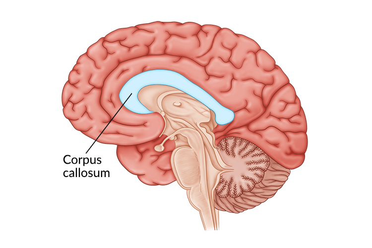
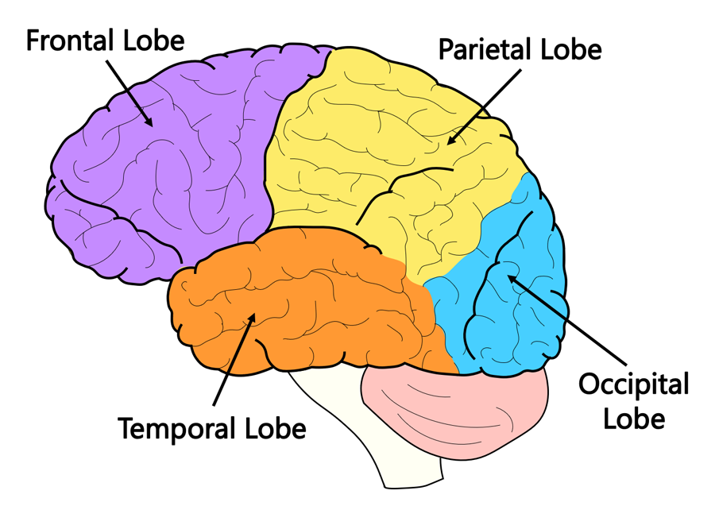
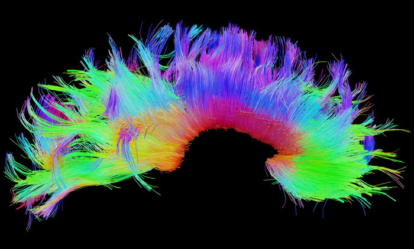
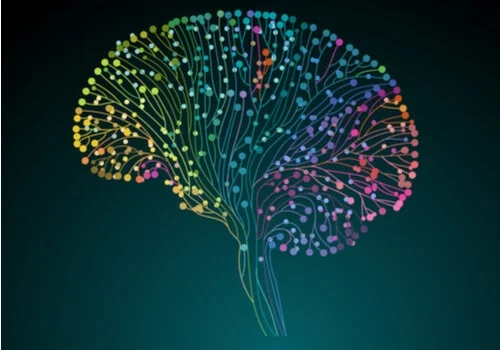

# Neuroanatomy: The Basics

The brain is the body’s command center. This specialized organ is responsible for every thought, every feeling, and the vast majority of our actions.

Its unique (and complex) three-dimensional architecture plays an important role in deciding upon and issuing those important commands.

**Over the past few hundred years, scientists have learned that the brain has dedicated regions responsible for specific tasks like understanding and producing speech or processing visual and spatial information.**

Each part of the brain’s intricate configuration works together to govern sensation and perception, information processing, and the initiation of a wide variety of behaviors—and helps us make sense of the world around us.

## The Nervous System

The nervous system is a complex network of nerves and cells that carry messages to and from the brain to the rest of the body.

The nervous system has two main parts: the **central nervous system (CNS)**, made up of the spinal cord and the brain; and the **peripheral nervous system (PNS)**, the nerves and other types of supporting cells that branch throughout the rest of the body and communicate back to the CNS.

Some further break down the CNS into the hindbrain, the lower part of the brainstem; the midbrain, the central part of the brainstem; and the forebrain, which includes the cerebral hemispheres.

**But the CNS may also be discussed in terms of these three sections: the brain stem, the cerebellum, and the cerebral hemispheres.**

The **brainstem** is responsible for autonomic processes, or processes that occur reflexively, like breathing and heart rate. It also helps conduct information from the brain to the PNS.

The **cerebellum**, the so-called “little brain,” next to the brain stem, handles balance and coordination of movement.

Finally, perched above the brainstem and cerebellum, is the **cerebral cortex**. This is probably what you think of when you picture the brain—and it is responsible for sensory perception, information processing, and memory, learning, and decision-making.

The parts of the CNS work together seamlessly in healthy individuals, allowing the brain to govern functions and behaviors ranging from breathing to reading.

## The Hemispheres

The cerebral cortex is divided into two hemispheres.

These two sides of the brain are connected by the **corpus callosum**, a bridge of wide, flat neural fibers that help relay signals between them.

## The Lobes

The cerebral hemispheres are further subdivided into four major lobes: the occipital, towards the back of the brain; the parietal, just above the ear; the temporal, just behind the forehead temples; and the frontal, resting above the eyes at the very front of the cortex.

**These areas can also tell us a bit about function.**

The **occipital lobe** is mainly responsible for processing and interpreting visual information. It’s the seat of the primary visual cortex.

The **temporal lobe** is the major processing center of sound (including language) and some forms of memory.

The **parietal lobe** is the home of the somatosensory cortex, the area of the brain responsible for processing sensation and touch information, as well as some aspects of spatial processing.

The **frontal lobe** is the most complex part of the human brain—the bit that separates us from our primate cousins, so to speak. This, the largest brain lobe, is responsible for executive function, with a hand in reasoning, decision-making, sensory integration, planning, and execution of movement.

## Folds & Grooves

The cortex is gathered and pleated into a unique configuration. The outer bump in each pleat is called the **gyrus**, while the groove inside each fold is called the **sulcus**. **No two human brains are folded in the exact same way.**

Yet, several of these folds are large and pronounced enough to have their own names.

For example, the **lateral sulcus**, the inner fold that separates the temporal lobe from the frontal lobe, and its neighbor, the **temporal gyrus**, house the primary auditory cortex, the area of the brain that processes sound information.

**Wernicke’s Area**, that important language region, also can be found on the temporal gyrus.

References to gyri and sulci can help pinpoint more specific locations on a particular lobe of the cortex.

## Gray & White Matter

The brain’s most basic working unit is a special cell called the neuron.

Neurons are quite similar to other cells in the body but have specialized branching extensions called **dendrites** and **axons**. It’s those extensions that allow neurons to communicate with one another through synapses, small gaps between the cells where chemical messages are exchanged.

It’s the different sections of neurons that make up the brain’s two types of matter: gray and white matter.

**Gray matter** consists of the cell bodies and dendrites of neurons as well as other support cells called glia, or glial cells.

**White matter**, on the other hand, is made up of the neuron’s axons, sheathed in myelin, a fatty insulation that helps brain cells communicate more efficiently. It’s the myelin that gives white matter its signature color.

## The Connectome

Each part of the brain’s intricate configuration works together to govern perception, processing, and behavior—and help us make sense of the world around us.

Important regions of the brain are strongly connected to one another through circuits, or tracts of networked neurons that help those regions communicate with one another with ease.

Neuroscientists are learning that to understand brain function they need to look beyond functional segregation, or the localization of a particular function to a single area.

Rather, today, researchers are focusing their investigations on these important connections, using new techniques to follow critical circuits to better understand how groups of different brain areas work together to determine human behavior. This intricate pattern of connections is called the **connectome**.

