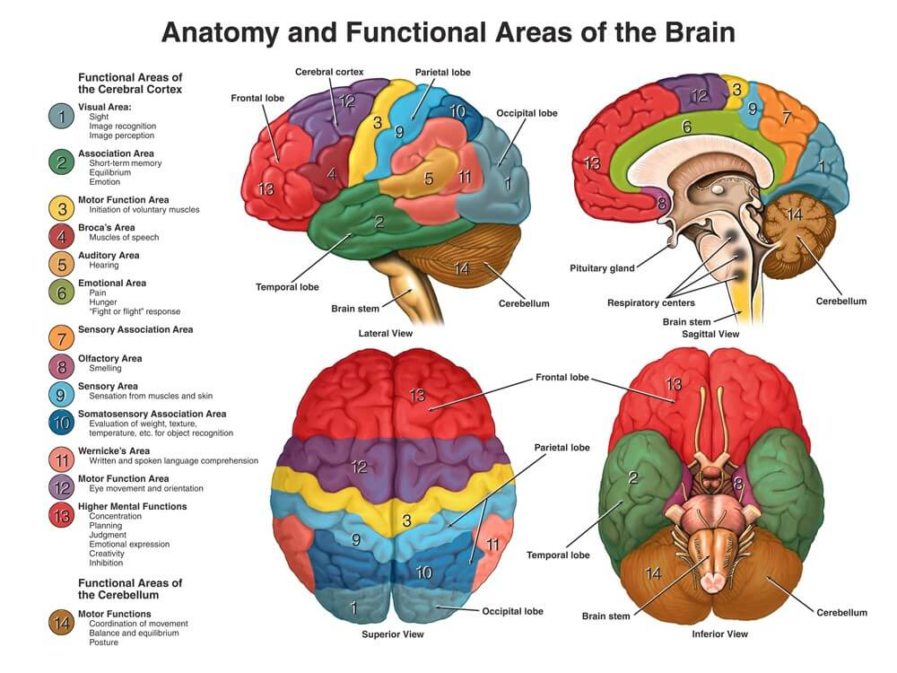
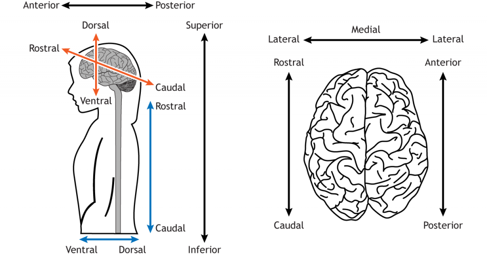
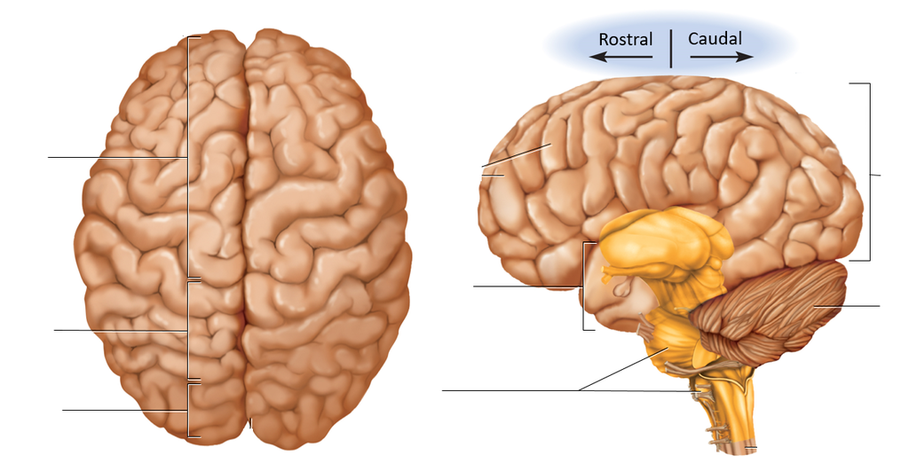
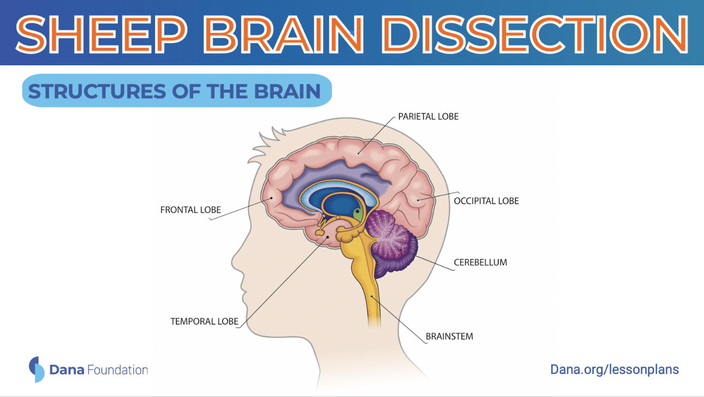
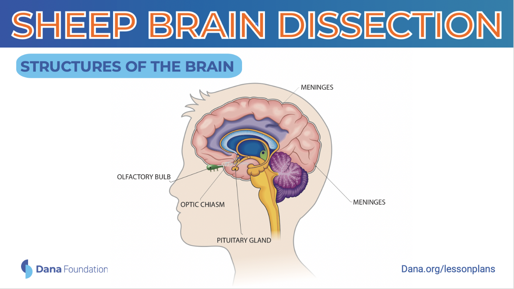
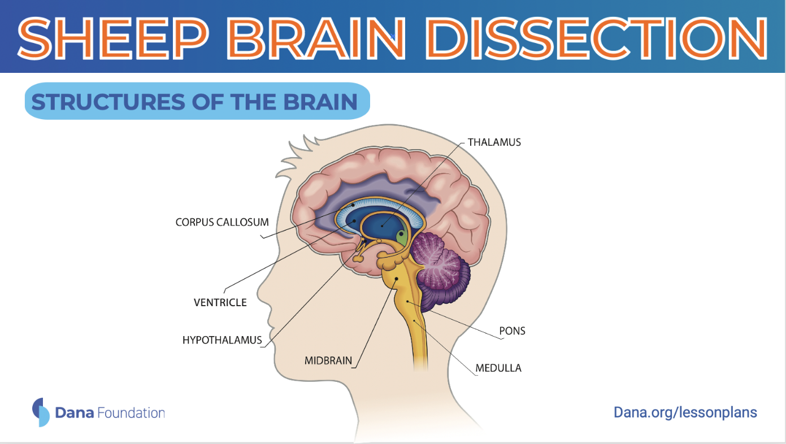
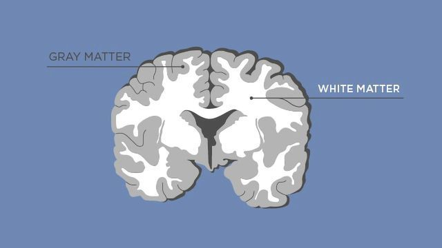
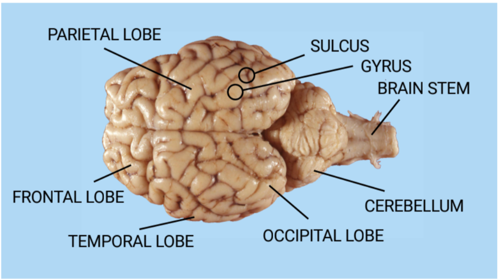
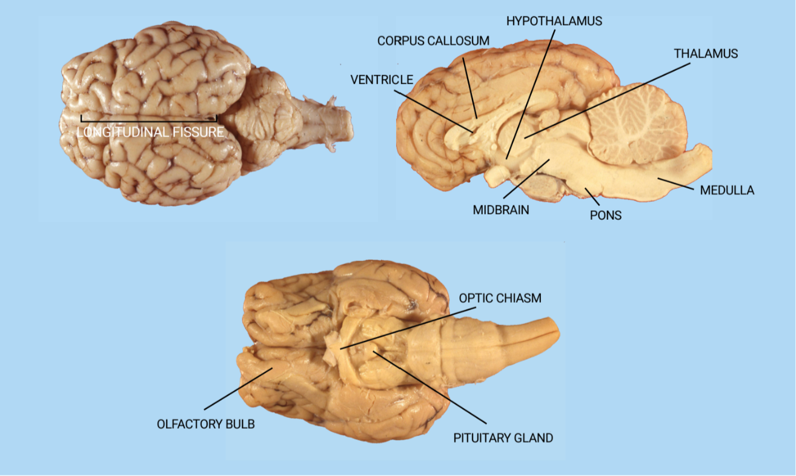
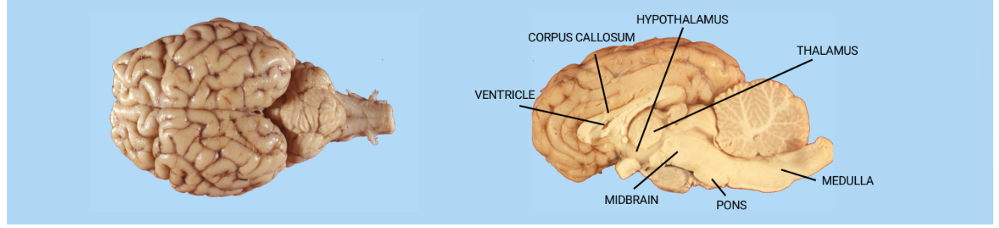

# Sheep Brain Dissection: Instructions

## Objectives
* Educate on brain anatomy and function, emphasizing the central role of the brain in regulating thoughts, emotions, and bodily movements.
* Explore the significance of comparative neuroanatomy in studying brain structures and functions across species, with a focus on the conserved organization of the mammalian brain.
* Develop practical skills in identifying and dissecting key brain structures, such as the cerebral cortex, cerebellum, and brainstem, through hands-on experience with sheep brain dissection.

## Background

### Overview of Brain Function and Structure

Understanding brain anatomy and function is essential as the brain serves as the central control system for the body, regulating thoughts, emotions, and most bodily movements. Scientists have identified brain regions responsible for tasks such as speech comprehension, visual processing, and spatial awareness. Each component of the brain collaborates to manage sensory input, process information, and initiate diverse behaviors, aiding our understanding of the surrounding world.

### Comparative Neuroanatomy & Sheep Brain Dissection

This section probes the structures of the brain, exploring their functions and highlighting the importance of comparative neuroanatomy. The basic organization of the mammalian brain is conserved across species, making sheep brains particularly valuable for comparative studies. The dissection of a sheep brain provides an opportunity to examine both external and internal brain structures. We will guide participants in identifying key regions such as the cerebral cortex, cerebellum, and brainstem. By dissecting the sheep brain, participants gain hands-on experience in recognizing anatomical landmarks and understanding their respective functions.

**TERMS**

* **Directional:**
  - **Anterior:** (rostral or “towards the nose”) towards the front
  - **Posterior:** (caudal or “towards the tail”) towards the back
  - **Lateral:** towards the side
  - **Medial:** towards the middle
  - **Dorsal:** (“towards the back”) on top
  - **Ventral:** (“towards the stomach”) on the bottom
  - **Coronal plane:** divides the brain from front to back. This is like slicing a loaf of bread.
  - **Sagittal plane:** divides the brain from left to right.
  - **Horizontal plane:** divides the top and the bottom of the brain.

* **The Nervous System:** a complex network of nerves and cells that carry messages to and from the brain to the rest of the body.
  - **Central nervous system (CNS):** made up of the spinal cord and the brain.
    - **Brainstem:** responsible for autonomic processes, or processes that occur reflexively, like breathing and heart rate. It also helps conduct information from the brain to the PNS.
    - **Cerebellum:** so-called “little brain,” next to the brain stem, handles balance and coordination of movement. 
    - **Cerebral cortex:** responsible for sensory perception, information processing, and memory, learning, and decision-making.
    - **Corpus callosum:** connects the two hemispheres.
  - **Peripheral nervous system (PNS):** the nerves and other types of supporting cells that branch throughout the rest of the body and communicate back to the CNS.
    - **Medulla:** the lowermost part of the brainstem. It plays a crucial role in controlling vital autonomic functions such as breathing, heart rate, and blood pressure.
    - **Pons:** located in the brainstem, just above the medulla. It serves as a relay station, facilitating communication between different parts of the brain, including the cerebrum and cerebellum.
    - **Optic Chiasm:** a structure located at the base of the brain, where the optic nerves partially cross over each other. It is involved in the transmission of visual information from the eyes to the brain.
    - **Pituitary Gland:** The pituitary gland, often referred to as the "master gland," is a pea-sized gland located at the base of the brain. It secretes hormones that regulate various bodily functions, including growth, metabolism, and reproduction.
    - **Ventricles:** fluid-filled cavities within the brain, and they are part of the central nervous system (CNS). They produce and circulate cerebrospinal fluid, which is essential for the protection and nourishment of the brain and spinal cord.
    - **Cerebrospinal Fluid (CSF):** produced within the ventricles of the brain and circulates around the brain and spinal cord. It is part of the central nervous system (CNS) and serves to cushion and protect the neural tissue.
    - **Arbor Vitae:** a distinctive pattern of white matter within the cerebellum, which is part of the central nervous system (CNS). It consists of axons that carry signals to and from the cerebellar cortex, contributing to motor coordination and balance.

* **Dura Mater:** outermost and toughest membrane layer surrounding the brain and spinal cord. It provides protection and support to the central nervous system.
* **Sulcus:** a groove or furrow on the surface of the brain, separating adjacent gyri.
* **Corpus callosum:** The corpus callosum is a thick band of nerve fibers that connects the left and right hemispheres of the brain, allowing communication between the two hemispheres.
* **Gyrus:** A gyrus is a raised fold or ridge on the surface of the brain, typically found between sulci.
* **The Lobes:**
  - **Occipital** - towards the back of the brain
    - Responsible for processing and interpreting visual information. It’s the seat of the primary visual cortex.
  - **Parietal** - just above the ear
    - Home of the somatosensory cortex, the area of the brain responsible for processing sensation and touch information, as well as some aspects of spatial processing.
  - **Temporal** - just behind the forehead temple
    - The major processing center of sound (including language) and some forms of memory.
  - **Frontal** - resting above the eyes at the very front of the cortex
    - Responsible for executive function, with a hand in reasoning, decision-making, sensory integration, planning, and execution of movement.
* **Neuron:** The basic building blocks of the nervous system, responsible for transmitting information throughout the body. They consist of a cell body, dendrites, and an axon.
  - **Dendrites:** branch-like structures that extend from the neuron's cell body. They receive signals from other neurons and transmit them to the cell body.
  - **Axons:** long, slender projections of a neuron that transmit electrical impulses away from the cell body to other neurons, muscles, or glands. They are often covered in myelin, which helps speed up the transmission of nerve impulses.
* **Schwann cells:** found in the peripheral nervous system. They produce the myelin sheath that wraps around axons, providing insulation and speeding up the transmission of nerve impulses.
* **Gray matter:** consists of the cell bodies and dendrites of neurons as well as other support cells called glia, or glial cells.
* **White matter:** made up of the neuron’s axons, sheathed in myelin, a fatty insulation that helps brain cells communicate more efficiently. It’s the myelin that gives white matter its signature color.

## Human

## Sheep

**References:**

* Dana Foundation Sheep Brain Dissection Lesson Plan
* Dana Foundation Neuroanatomy Basics, and Anatomical Terminology
* University of Illinois Project Neuron Sheep Exploration Guide
* Neuroanatomy Basics Henley, C. (2021). Anatomical Terminology. In *Foundations of Neuroscience* (Open), Michigan State University Libraries. Retrieved from https://openbooks.lib.msu.edu/neuroscience/.

## Materials

* Gloves
* Sheep brains
* Scalpels
* Forceps
* Dissection scissors
* Dissection trays
* Lab glasses
* Paper towels
* Skinks
* Hand soap
* Disinfectant wipes
* Sheep brain dissection guide handout

## Activity Instructions

Bring class to attention and tell them what they will be doing for the next hour (Good Morning! My name is XXX and today my friends and I are going to teach you a little about the brain. To do that, we are going to cut up a sheep brain!)

### Part I: Gross Anatomy 

1. Before we cut open our brains, I want to show you some really cool parts of the brain!
   * Students obtain sheep brains and begin observing gross anatomy.
2. If dura mater is present, have students take it off.
   * Ask them if they know what dura mater means
     - Dura mater means “tough mother” in Latin.
   * What do students think the dura mater does?
   * Also point out that there is the arachnoid mater (spider mother; beneath the dura mater) and the pia mater (soft mother; associated with the brain and is more thin and transparent) that protect the brain
3. Now that the dura mater is off, I can show you some more stuff about the brain. Our brains do a lot of things! First we have the...
   * Cerebrum = biggest part of the brain
     - Responsible for a LOT of things and is broken down into 4 regions or lobes.
   * The occipital lobe receives and interprets visual sensory messages.
   * The temporal lobe is involved in hearing and smell.
   * The frontal lobe also plays a part in smell, plus dealing with motor function.
   * The parietal lobe handles all the sensory info except for vision, hearing, and smell.
   * There are 2 hemispheres: right and left.
   * Cerebellum = responsible for balance.
4. Turn brain over so students are looking at it ventrally.
   * Brain stem
   * Medulla = Here the nerves cross over so the left hemisphere controls the right side of the body and vice versa.
     - This area of the brain controls the vital functions like heartbeat and respiration (breathing).
   * Optic chiasm = responsible for sight
   * Olfactory bulb = responsible for smell
   * The pons are next to the medulla.
     - It serves as a bridge between the medulla and the upper brainstem, and it relays messages between the cerebrum and the cerebellum.
     - The pituitary gland, which produces important hormones that help you grow and a lot of other cool stuff, is a sac-like area between the pons and the optic chiasm.

**Possible questions to ask:**

How much do you think the human brain weighs? \
3 pounds!

Why is the brain so wrinkly? \
Brain size is limited by skull. These bumps and grooves help fit a lot of neurons in our brain by making more room on the surface.

### Part II: Dissection

1. Students obtain sheep brain again and use scalpel to sever brain along the corpus callosum.
   * Corpus Callosum = a bundle of white fibers that connects the two hemispheres of the brain, providing coordination between the two).
2. Use one half of the brain for locating and labeling the different lobes and important structures.
   * Ventricles contain cerebrospinal fluid.
   * The thalamus is a "relay station" for sensory information. It receives messages from the nerve axons and then transmits them to the appropriate parts of the brain.
   * The pineal gland produces important hormones.
3. Have them cut through the cerebellum.
   * Ask students what it looks like (they should say tree, brush, etc.).
   * Point out that this is called the arbor vitae (which means living tree!)
4.  After observing and labeling the required structures, one half of the brain should be sliced longitudinally.
5. The other half can be sliced as desired.
   * Allow students to explore the brain on their own.
6. Students observe their slices and compare how the makeup of the brain is different.
7. To finish up, ask visitors how the human brain might be different than a sheep brain (mainly, a human brain is bigger-about the size of 2 fists put together).
8. Discard of brain specimens, clean tools and trays, and have participants wash their hands with soap and water.

## Take-Home Points

* The brain can be divided into many areas containing different structures, each with their own function.
* Studying brain structures across species aids in scientific understanding.

## Activity Examples

YouTube videos:
* [Full demo sheep brain](https://www.youtube.com/watch?v=y7gEWzPqm94&ab_channel=humananatomy1)
* [Sheep Brain Dissection Pt. 1 of 2](https://www.youtube.com/watch?v=yNWQUN4jg-s&t=1s&ab_channel=BioBeware)
* [Sheep Brain Dissection Pt. 2 of 2](https://www.youtube.com/watch?v=Lrh0pVelVvE&t=1s&ab_channel=BioBeware)
