# Sheep/ Cow Eye Dissection: Instructions

## Objectives
* Educate on the anatomy of the eye and the visual pathway to brain stem.
* Explore the function of each part of the eye and how they work together to facilitate vision.
* Educate on safety protocols for handling biological specimens and dissecting tools.
* Examine the similarities and differences between a human eye and a sheep eye.

## Background

### Eye External Structures

Cornea: Anterior protective covering of the eye; transparent allowing light to enter; appears cloudy due to preservation process

Essential Fat: White/grey in color; provides protection/cushion

Extrinsic muscles: Muscles used to move the eye

Optic nerve: Chord-like structure protruding from the back of the eye; carries nervous signal from the retina to the posterior (occipital) region of the brain

### Eye Internal Structures

**Vitreous humor:** Jelly-like material, provides shape/support for the eyeball, helps hold retina in place

**Retina:** Nervous tissue, location of the photo receptors (cones for sharp color vision and rods for night, dark/shaded vision); the retina is continuous with the optic nerve which leaves the back of the eye carrying the nervous impulse to the brain

**Optic disc (blind spot):** location on the retina where the retina attaches to the optic nerve, sight does not occur at this location because there are no cones or rods present

**Fovea centralis/macula:** Location in eye where the sharpest vision occurs; the fovea centralis/macula is dense with cones and is the location of focus during lighted conditions, like reading (in humans); the fovea centralis/macula appears as a depression in the retina

**Choroid:** Dark layer of the eye, rich with blood vessels; reduces scattering of light and provides nourishment for the eye

**Tapetum lucidum:** Iridescent, reflective layer found on the choroid; the tapetum lucidum aids in the reflection of light, increasing the ability to see at night; the human choroid does not have a tapetum lucidum

**Sclera:** Tough protective outer layer of the eye which gives the eyeball it’s shape; the white part of the human eye; continuous with the transparent cornea; the sclera has blood vessels (may appear bloodshot); the cornea does not have blood vessels

**Suspensory ligaments:** Hold the lens in place, attaches lens to ciliary body

**Aqueous humor:** a transparent fluid produced by the ciliary body is located between the lens and the cornea; the fluid provides shape for and nourishes the cornea and it also provides nourishment for the lens

**Lens:** Biconvex structure that focuses light on the retina through a process called accommodation

**Ciliary body:** Muscles of the ciliary body contract toward the lens, resulting in less pull on the lens; the lens bulges to its natural form resulting in the light rays bending more for closer objects; the muscles of the ciliary body relax pulling away from the lens causing the lens to flatten for distant objects

**Pupil:** Opening of the eye, allows light to enter; the diameter of the opening is controlled by the iris; the pupil is the dark center of the eye; the pupil is black because light enters but it does not leave.

**Iris:** Structure of the eye which controls the size of the opening into the eye which is called the pupil; the pupil gets larger when the radial muscles of the iris contract in dim light; the circular/sphincter muscles of the iris contract to reduce the size of the pupil for brighter light; the iris is the colored structure of the human eye

*Adapted from Dissection 101: Cow Eye Student Checklist. Dakota State University and South Dekota Public Broadcasting*

### Pathway to cortex

After a visual stimulus, light enters the eye and is focused onto the retina, where photoreceptor cells convert it into electrical signals. These signals travel along the optic nerve to the thalamus before entering the primary visual cortex (V1) located in the occipital lobe. Visual information is then processed and integrated so that it is perceived and interpreted. From V1, the processed information is further relayed to other brain areas (V2, V3, V4, and V5) for higher-level processing and interpretation.

Reference: Huff T, Mahabadi N, Tadi P. Neuroanatomy, Visual Cortex. [Updated 2023 Aug 14]. In: StatPearls [Internet]. Treasure Island (FL): StatPearls Publishing; 2024 Jan-. Available from: https://www.ncbi.nlm.nih.gov/books/NBK482504/

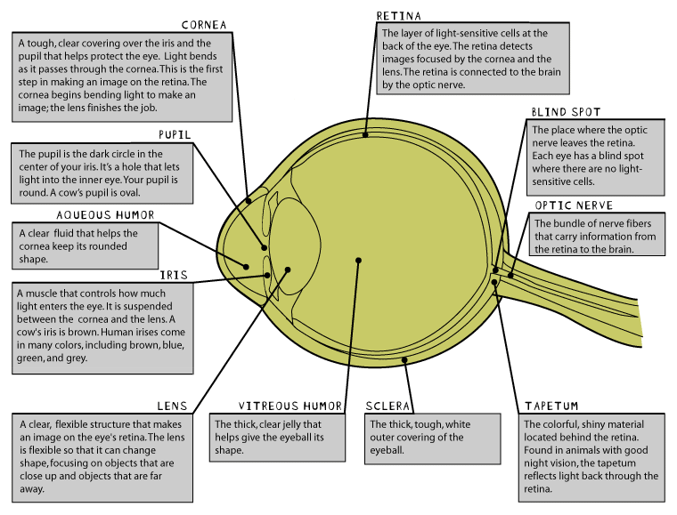

## Materials
* Safety Data Sheet (SDS) available for accident reference
* Poison control number/phone readily available
* Latex-free gloves
* Eye protection
* Apron/lab coat
* Eyewash station
* Sink
* Sharp instruments
* Sharps and specimen(s) disposal

## Activity Instructions

> [!IMPORTANT]
> Inform participants of safety measures!

Safety measures:
* Always cut away from yourself.
* Use gloves.
* Wash your hands afterward.

**Educate:** Demonstrate to participants the names and functions of each part of the eye.

Vision perception: When you look at something, light goes into your eyes and changes into signals that travel to your brain. These signals help you see things. First, they go to a part of the brain called the thalamus, and then they go to a special area in the back of your brain called the visual cortex. This part of your brain helps you understand what you see. It's like a computer that helps you figure out what things are when you look at them.

**Activity:**

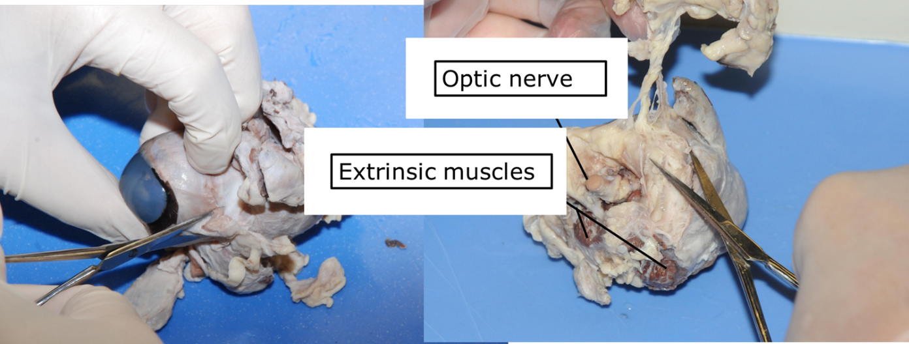

1. Ask the participants to examine the outside of the eye and see how many parts they can identify (**sclera, fat, muscle, cornea, iris, pupil**).

2. Use scissors or scalpel to remove the excess fat from the eyeball.

3. The extrinsic muscles, which are used to move the eye, should also be removed.

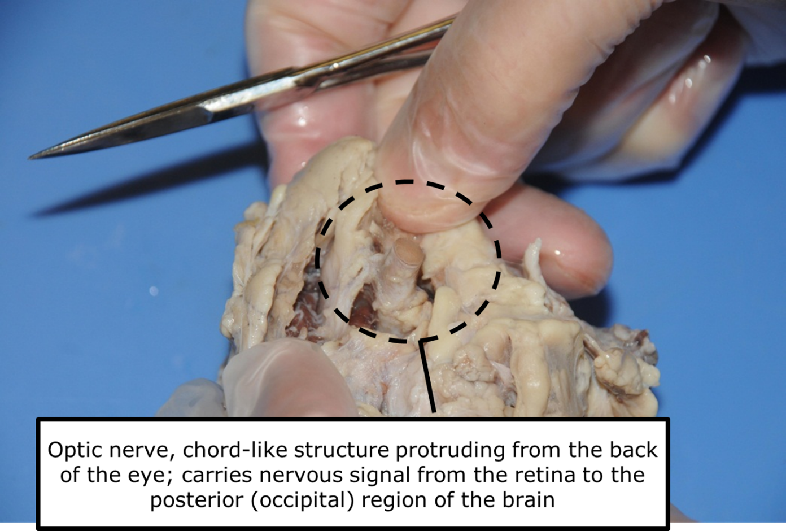

4. Point out the **optic nerve**. Do not remove.

5. **Educate:** The nerves that go out of the back of the eye form the **optic nerve**. It carries messages from the eye to the brain. If you squeeze the optic nerve, you may get some white goop. That is myelin, the fatty layer that surrounds each fiber of the nerve.

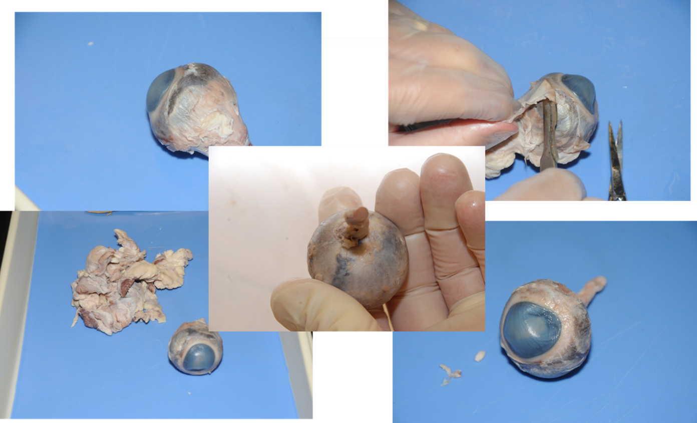

6. Continue using scissors or scalpel to remove the fat, connective tissue and muscle from the back of the eye.

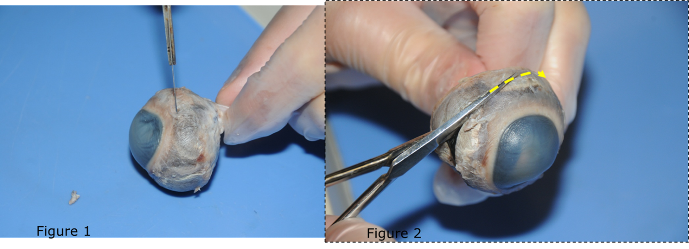

7. Use the point of a scissors or a scalpel to make an incision through the layers of the eye capsule (similar to figure 1)

8. **Educate:**
   * There are three layers from the exterior: **sclera** (whitish/grey, continuous with the transparent cornea), **choroid** (thin dark black layer), and the **retina** (thin greyish/pink layer.
   * The clear liquid is the **aqueous humor** (mostly made up of water and keeps the shape of the cornea).

9. Use scissors to dissect the entire circumference of the capsule (see figure 2); do not cut toward the cornea.

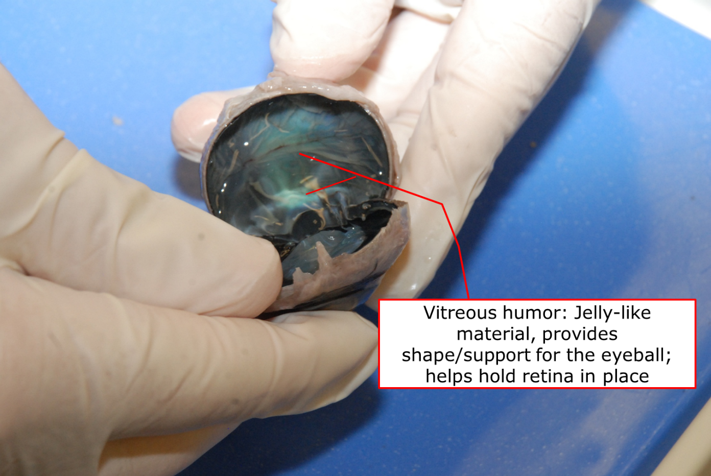

10. Using steady pressure, pull the two sections slowly apart.

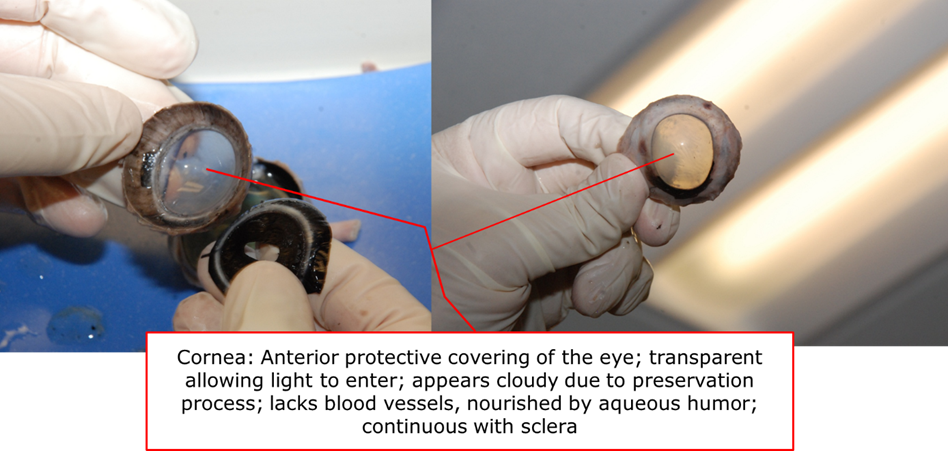

11. You’ll end up with two halves. On the front half will be the **cornea**.

12. **Educate:** The cornea protects the eye. It also helps you see by bending light that comes into your eye.

13. Ask participant to place the cornea on a board or other cutting surface and cut it with the scalpel or razor. The crunch that they hear is the sound of the scalpel cutting through all the layers of clear tissue which protect the eye from damage.

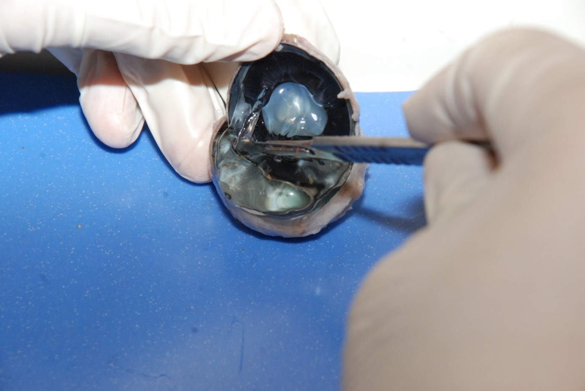

14. **Educate:** The **vitreous humor** is a mixture of protein and water. It is clear so light can pass through it. It also helps the eyeball maintain its shape.

15. Using your finger or forceps, carefully scrape any of the jelly-like vitreous humor that is attached to the front of the eye.

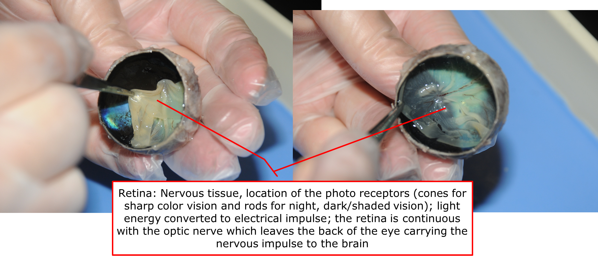

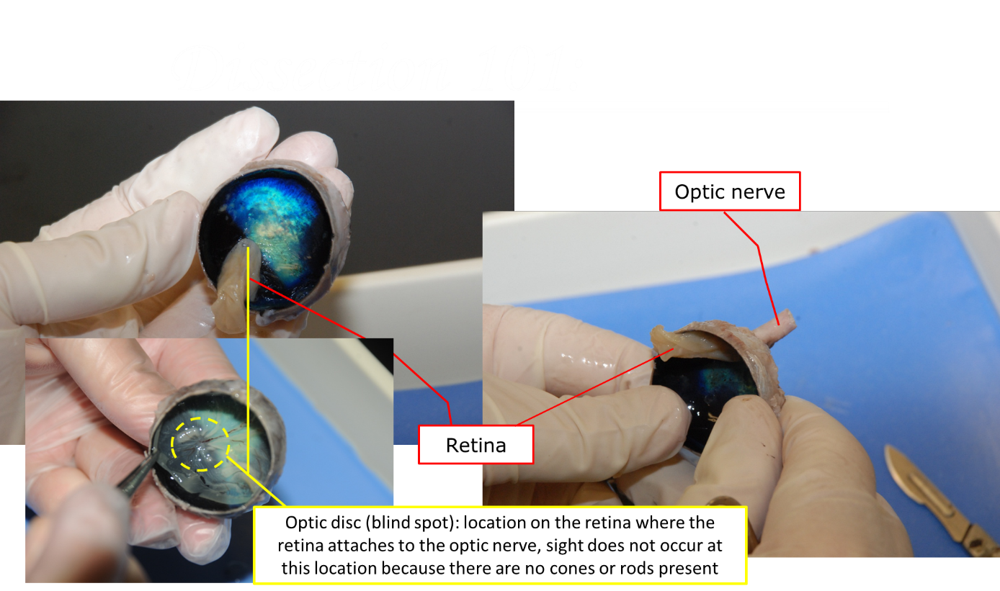

16. **Educate:**
   * The **fovea centralis/macula**, which is the location in eye where the sharpest vision occurs it is dense with cones and is the location of focus during lighted conditions, like reading (in humans). The fovea centralis/macula appears as a depression in the **retina**, but it is very difficult to find.
   * The **retina** is the thin fleshy film that detects light. The brain uses information from the retina to make a mental picture of the world. The spot where the retina is attached to the back of the eye is called the blind spot. Because there are no light-sensitive cells at that spot, you can’t see anything that lands in that place on the retina.

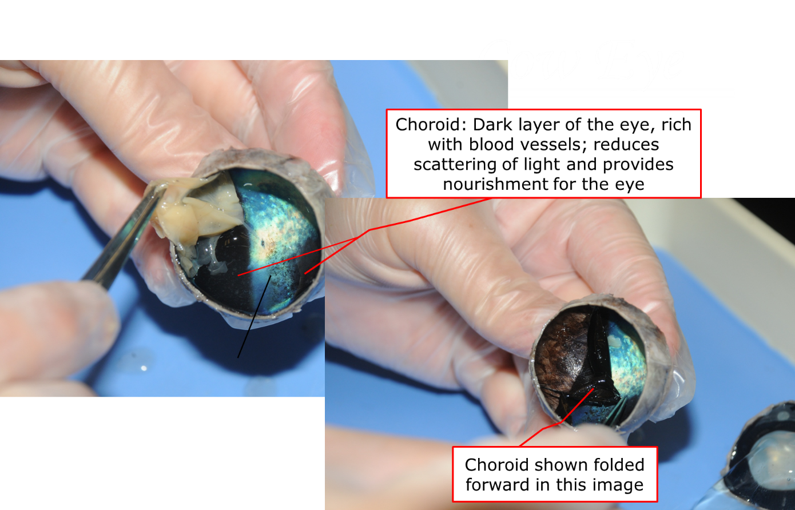

17. **Educate:** Many vertebrates like cows, deer, and cats have a **tapetum lucidum** which is an iridescent, reflective layer. It reflects light from the back of the eye, increasing the ability to see at night; **the human choroid does not have a tapetum lucidum.**

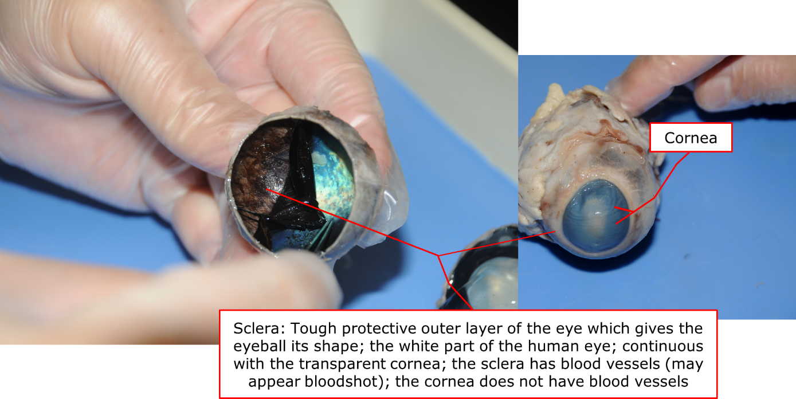

18. **Educate:** The **sclera** is the tough, outer covering of the eyeball.

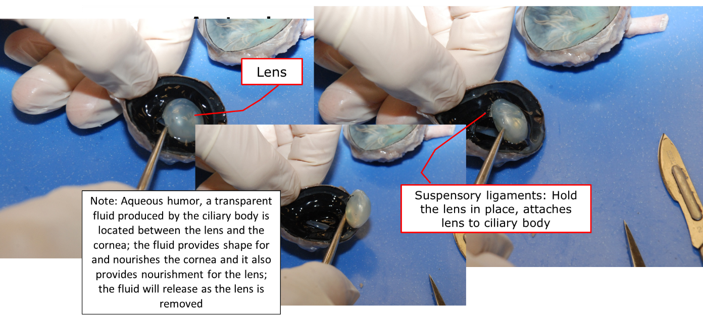

19. Using a dissection probe, carefully remove the lens from the anterior of the eye.

20. **Educate:** The **lens** is a clear lump about the size and shape of a squashed marble. It uses the light that comes into the eye to make an image, a picture made of light. That image lands on the **retina**. The cells of the retina react to the light that falls on them and send messages to the brain.

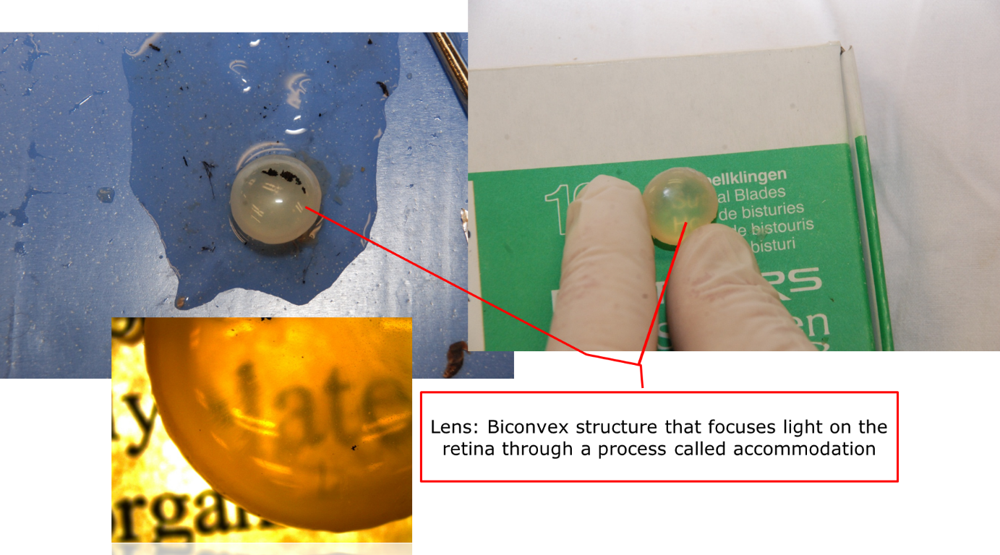

21. Ask the participant to hold the lens up and look through it, then describe what they see.

22. Ask the participant to put the lens on a newspaper and look through it at the words on the page and describe what they see.

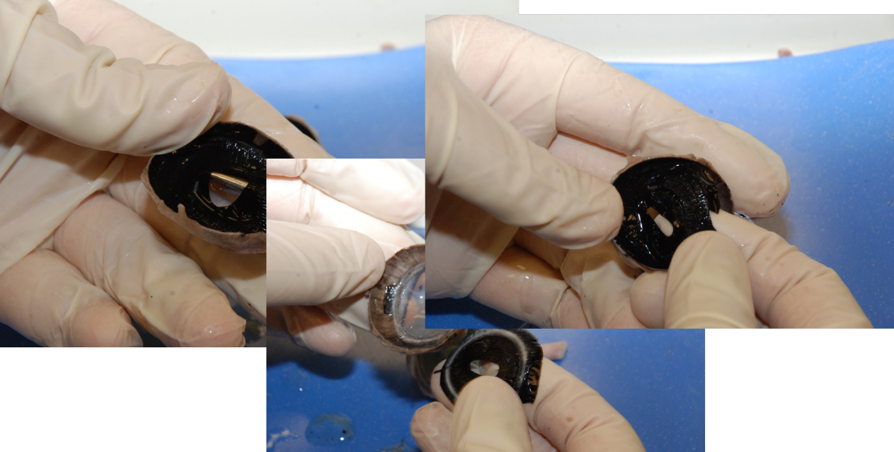

23. Using a dissection probe, carefully remove the choroid, ciliary body, and iris from the anterior of the eye; these structures will be removed as one unit.

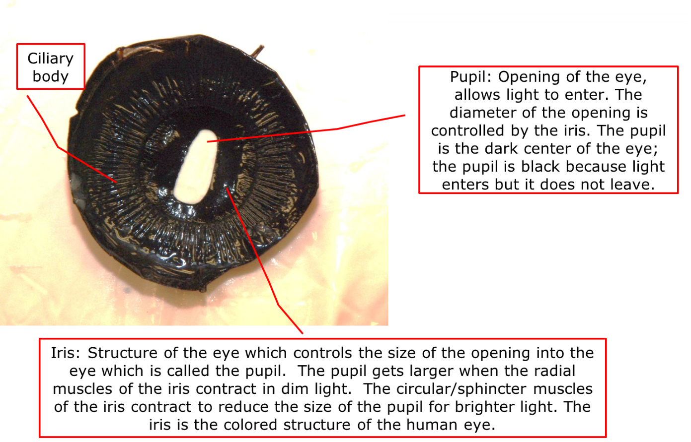

24. **Educate:** Point out the ciliary body, pupil, and iris.

The **pupil** is the hole in the center of the iris, it lets light into the eye. It contracts or expands to change the size of the pupil. pupil. In dim light, the pupil opens wide to let light in. In bright light, the pupil shuts down to block light out.

*Adapted from Dissection 101: Cow Eye. Dakota State University and South Dekota Public Broadcasting*

## Take-Home Points
* The eye is made up of many structures which have different functions and work together to facilitate vision.
* Cow/Sheep eyes are similar to human eyes, but there are some differences.
* Following safety is important when handling specimen and sharp instruments.

## Activity Examples

[YouTube video](https://www.youtube.com/watch?v=6mNs_TcUyHc)
