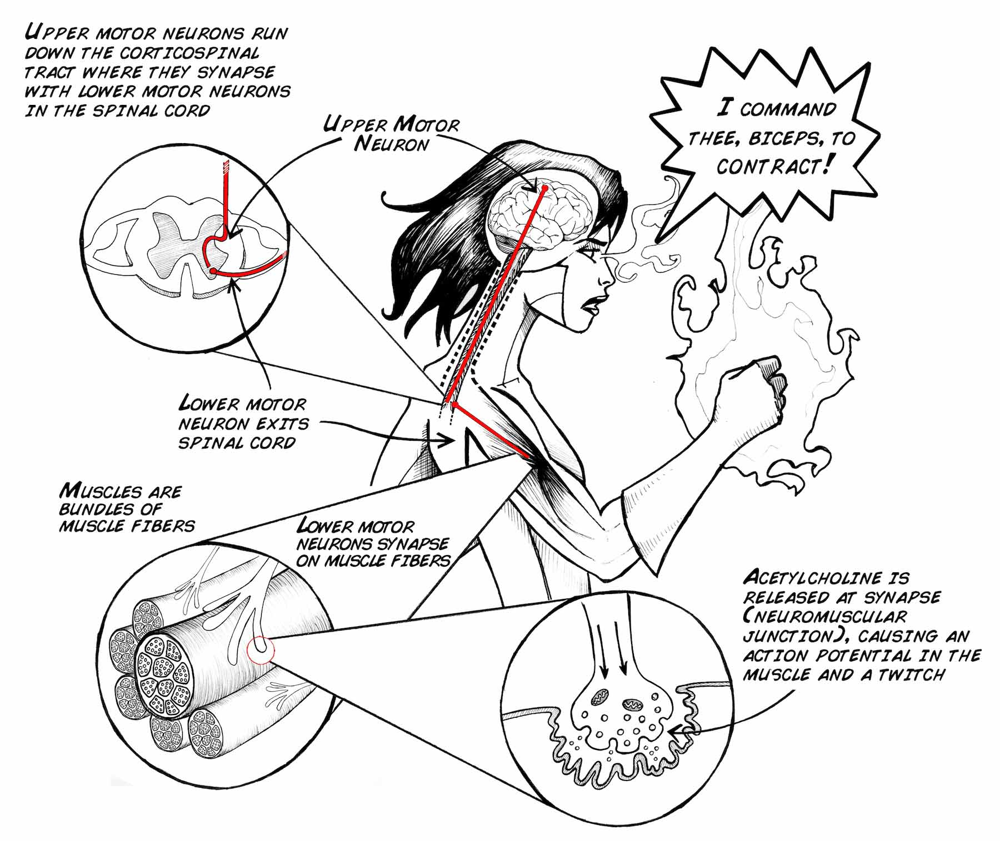
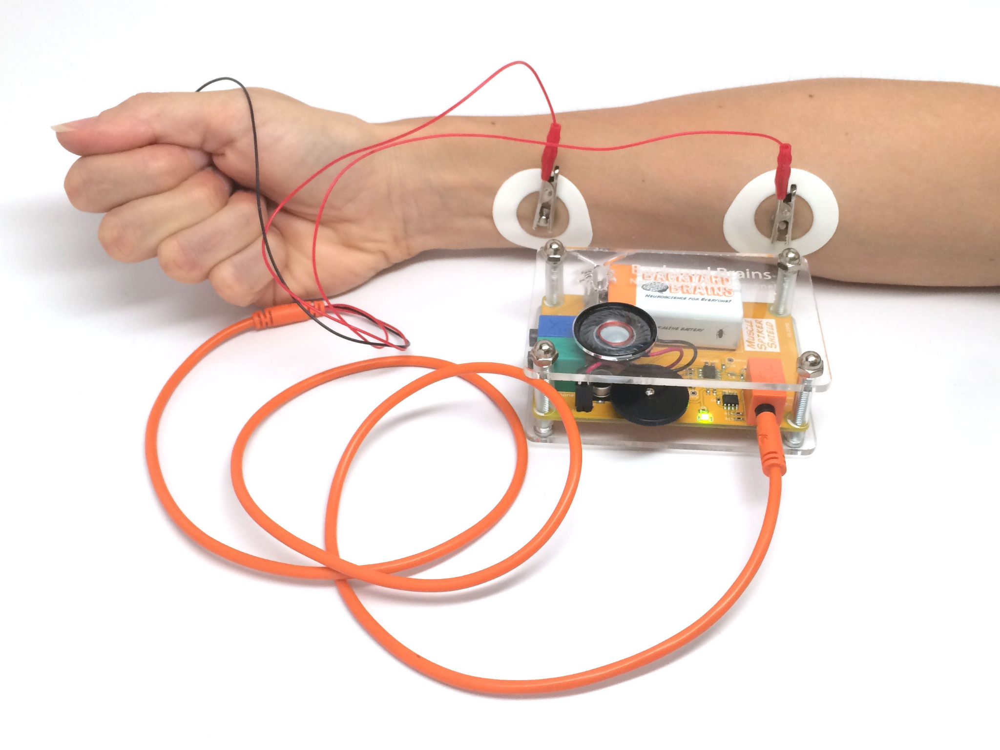
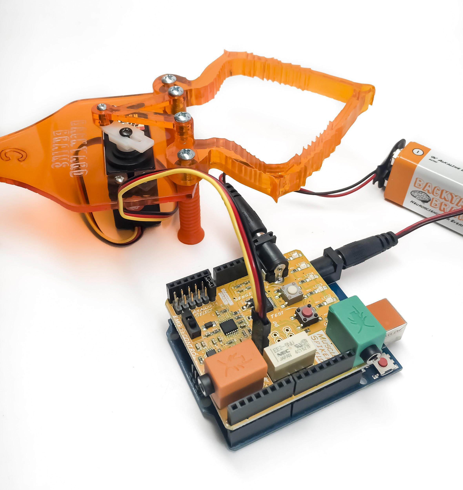
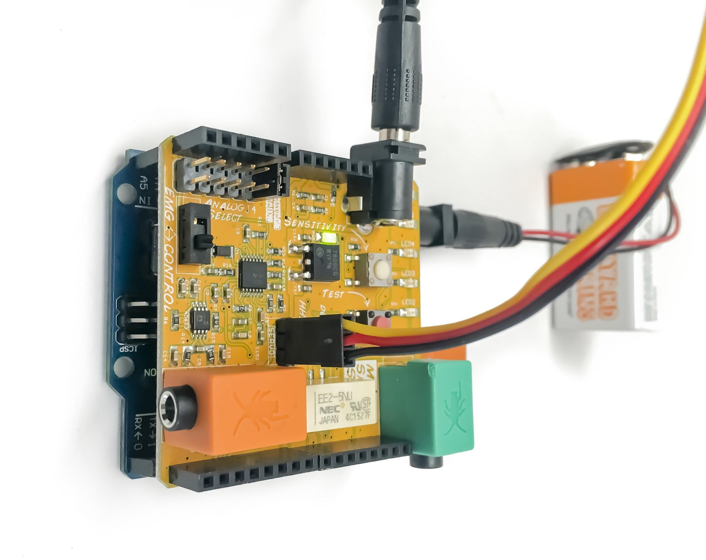
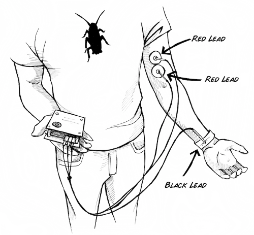
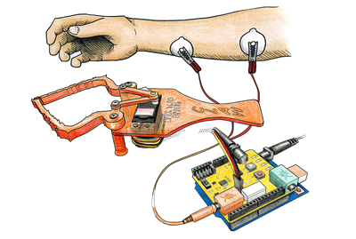
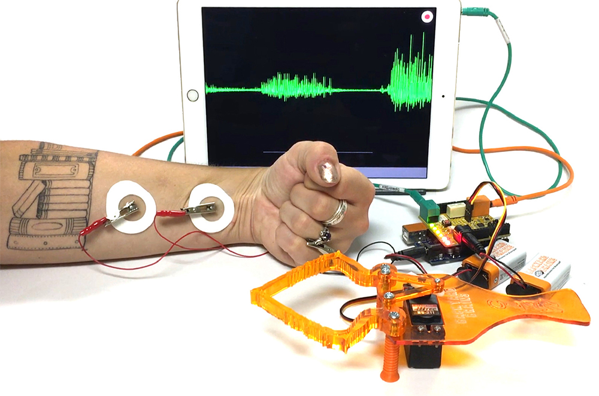

# Explore your Muscles: EMG Instructions

## Objectives
1. To educate attendees about muscle physiology and neuron muscle communication.
2. To explain how we can relate electromyagram (EMG) recording to muscle activation and neuronal firing.

## Background

### Neuromuscular system

The neuromuscular system includes all the muscles in the body and the nerves connecting them. Nerves and muscles work together in the neuromuscular system to make your body move as you want it to, and manage important functions such as breathing.

### Signal transmission

Neurons carry messages to and from the brain through the spinal cord to muscles in your body. Outgoing messages travel from the brain along the motor pathways to activate the muscles of the body. The neurons that make up these pathways are called motor neurons. Incoming messages are sent from the senses (your eyes, and nose, for example) back to the spinal cord and brain come along the sensory pathways. These are called sensory neurons.

### Motor units and muscle contraction

When your brain decides to move a muscle, neurons from your motor cortex (called "upper motor neurons") travel to your spinal cord, where they synapse with "lower motor neurons" (also called "alpha motor neurons"). These motor neurons then synapse with muscle to make a "motor unit." A motor unit is a single motor neuron and the multiple muscle fibers it innervates. A muscle fiber is a very special type of cell that can change its shape due to myosin/actin chains sliding across each other.

A single motor neuron can synapse with multiple muscle fibers. In general, a large, powerful muscle like your bicep has motor neurons that innervate 1000s of muscle fibers, whereas small muscles that require a lot of precision, such as your eyeball muscles, have motor neurons that only innervate ~10 muscle fibers.

When a motor neuron fires an action potential, this causes a release of acetylcholine at the synapse between the neuron and the muscle (this synapse is also called the Neuromuscular Junction). This acetylcholine then causes changes in the electrical potential of the muscle. Once this electrical potential reaches a threshold, an actual action potential occurs in the muscle fiber! This action potential propagates across the membrane of the muscle, causing voltage gated calcium channels to open, which begins the cellular cascade that ultimately causes muscle contraction.

When you contract a muscle, this is the result of many muscle fibers firing action potentials and changing shape. We can record this our activity with our Muscle SpikerBox.

## Materials

> [!IMPORTANT]
> Make sure you have extra 9V batteries!

### EMG Activity

* 1x muscle SpikerBox (9v battery included)
* 1x orange muscle electrode cable with alligator clips (red, red, black)
* Muscle electrode stickers
* Laptop or a phone
* Speaker
* Green cable to connect to phone/laptop

### Claw Activity

* Robotic claw with black, red, and yellow cables
* Muscle SpikerShield
* Muscle elctrode stickers
* Arduino with preloaded code
* Orange muscle electrode cable with 3 alligator clips (red, red, black)
* Green cable to connect to phone/laptop

## Activity Instructions

### EMG Activity

1. Remove the sticky backing from the Large Muscle electrodes, and place these surface electrodes close to each other on your bicep.
2. Hook up the Muscle SpikerBox leads (the 2 red alligator clips) to the two surface electrodes on the bicep.
3. Place the reference electrode (Black) anywhere on the body.
4. Turn on the Muscle SpikerBox and listen for changes in activity. Do you notice a difference when you flex your muscles?
5. Plug in your SmartPhone Cable (with Android or iPhone apps installed) or computer (using our Backyard Brains PC app and a USB cable). Pick up something heavy. Do you see and hear a difference? The "Whoosh" is the sound of many action potentials occurring in your muscles as the muscles contract. You are listening to the conversation between your brain and muscle!

### Claw Activity

1. Plug the Servomotor cable into the three pin header on your Muscle SpikerShield.
   * **Order is important!**
   * The yellow side goes toward the center of the board.
2. Plug the two 9V batteries into the barrel connectors on the Muscle SpikerShield Board and the Arduino.
3. Place three sticker electrodes on the body: two on the forearm and one on the back of the palm.
4. Taking your orange electrode cable, connect the two red alligator clips on the electrodes on the forearm (order does not matter) and the black alligator clip on the ground on the back of the hand.
5. Plug the orange cable into the orange port on the Muscle SpikerShield.
6. Plug the additional battery into the barrel connector on the blue Arduino board to power up the system.
7. Now flex the arm! You should see the Claw move as well.
   * You can push the white button to change between high and low threshold modes, and you can push the red button to switch between default open or default closing.

## Take-Home Points

1. The brain plays an important role in our muscle movement, and ultimately tells the body to move.
2. Muscles send and receive information to/from the brain via specialized cells called neurons.
3. EMG activity can help us understand muscle activity by decoding the messages that are being sent from brain → muscle → brain.

## Activity Examples

### EMG ACTIVITY

### Claw Activity

