# Noisy Neurons: Background Information

Your brain uses a combination of chemicals and electricity to operate. Brain cells (neurons) communicate with each other to control your body. A brain with only 1 neuron is not a brain.

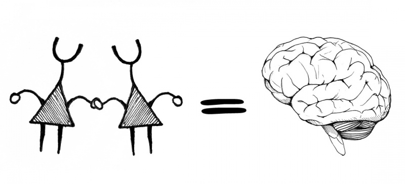

A brain is a network (friendship) of neurons. Your brain has and uses around eighty billion neurons! But how do all of these neurons talk to each other? One of the first ways cells used to network was chemical communication.

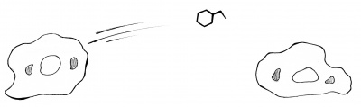

Bacteria use this method. It works well, but is limited by diffusion. For example, when you release an odor on one side of the room, how long does it take for someone on the edge of the room to smell it? There should be a faster way. One way is to bring cells closer together through stretching.

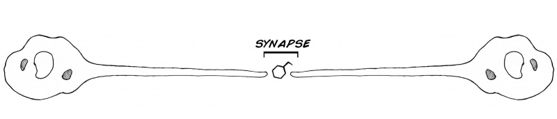

But there is still a problem. The signal still needs to travel a long way through the cell. Is there a way to make this faster? What is very fast and important today?

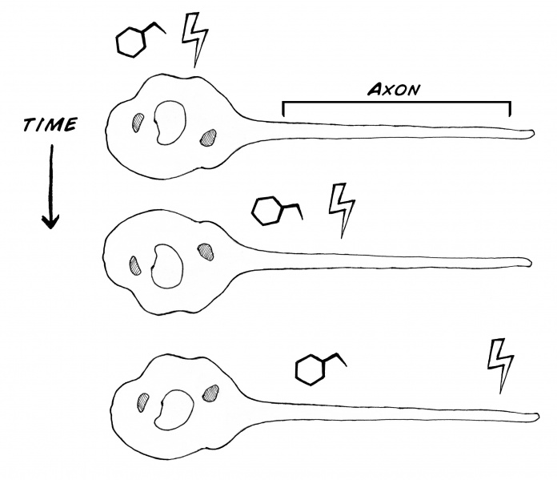

Electricity! Notice how fast the lights in your house turn on when you flick the switch. Neurons use electricity as well; electrical pulses travel down the neurons. This pulse is called the:

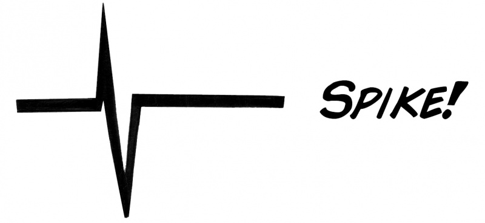

What shall we use to study neurons? 380 million years of evolution bring you the cockroach. That's even older than dinosaurs! We will use the Discoid cockroach (*Blaberus discoidalis*), or false death's head. They live in the Amazon rainforest of South America under the bark of rotting trees.

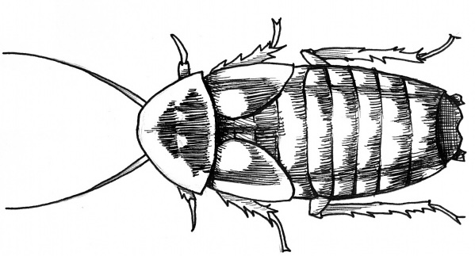

Like most multicellular animals (beyond creatures like sea sponges), cockroaches' bodies are filled with nerves (which are bundles of neurons) to control movement & sensation. As said above, neurons use a combination of electrical and chemical signaling to function.

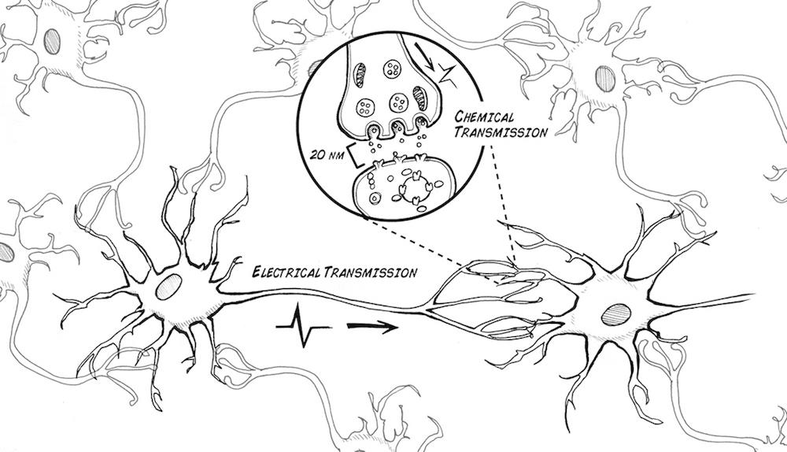

How does the neuron generate the electrical impulse? It is due to both a chemical and electrical difference across the inside and outside of the neural membrane.

The movement of sodium and potassium across the neural membrane causes the momentary change in voltage called the action potential or "spike".

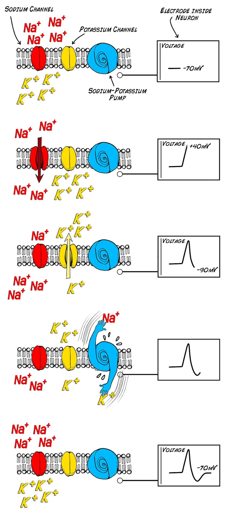

What happens when the spike reaches the end of the axon? It causes the release of neurotransmitter across the synapse, which can change the electrical properties of the next neuron, making it more or less likely to fire a spike of its own.

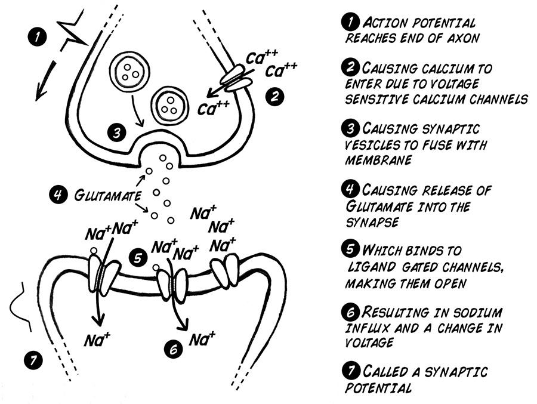

We will try to measure spikes, using the very reliable cockroach leg preparation (don't worry, the cockroach leg can grow back). You will be an electrophysiologist!

On the cockroach, each thorn on each leg is innervated by a neuron:

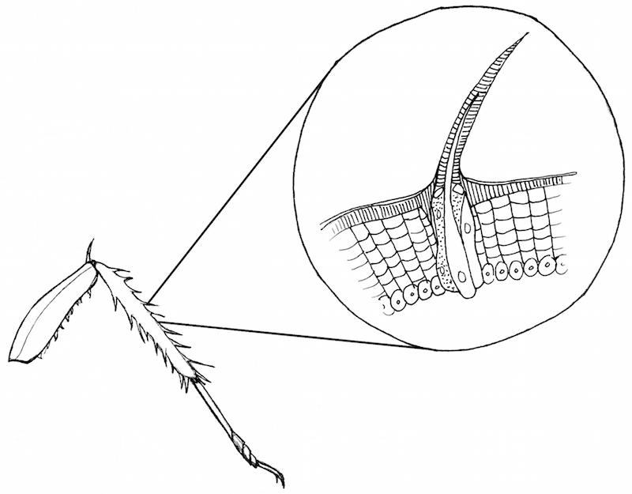

Touching the thorns causes the neurons to fire spikes. With more force applied to the thorn, even more spikes occur.

This relationship of spikes to stimulus strength is called **rate coding** and was first discovered in 1926 by Lord Edgar Adrian in England at the University of Cambridge (we will learn more about him later).

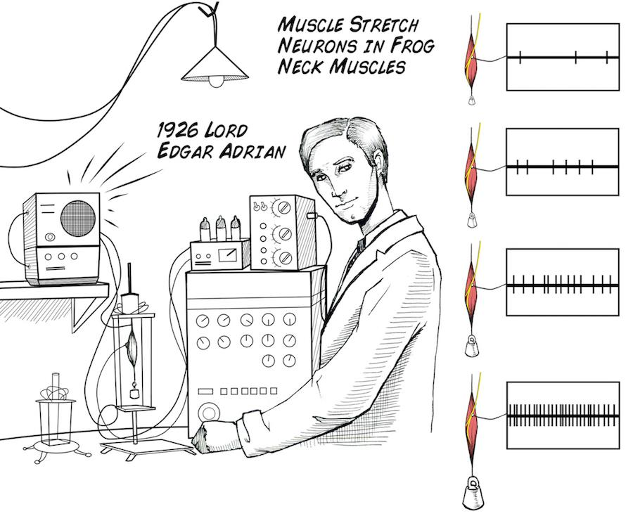

This rate coding is simply measuring the number of these spikes that occur during a set period of time. Even though it is simple, however, rate coding can be used to answer complex questions about how neurons respond to stimuli. Now we will remake this discovery and do the experiment.

