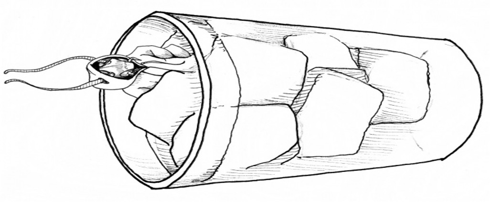
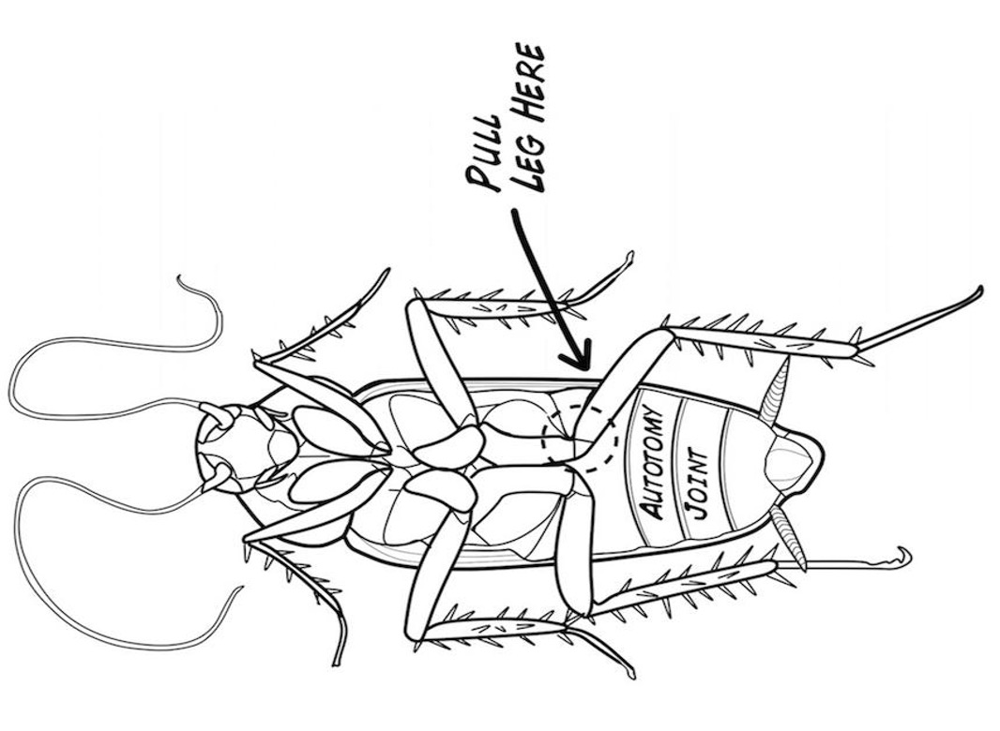
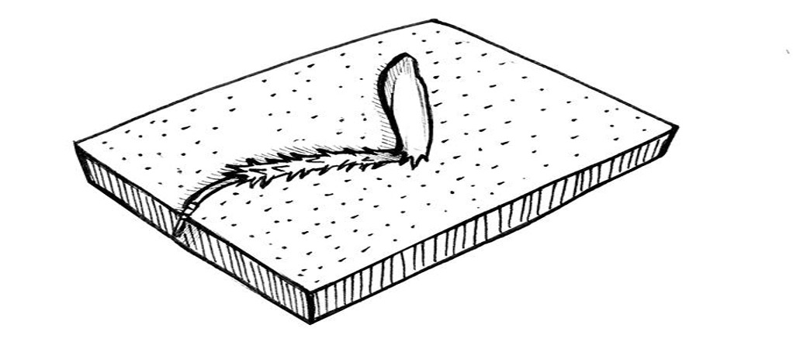
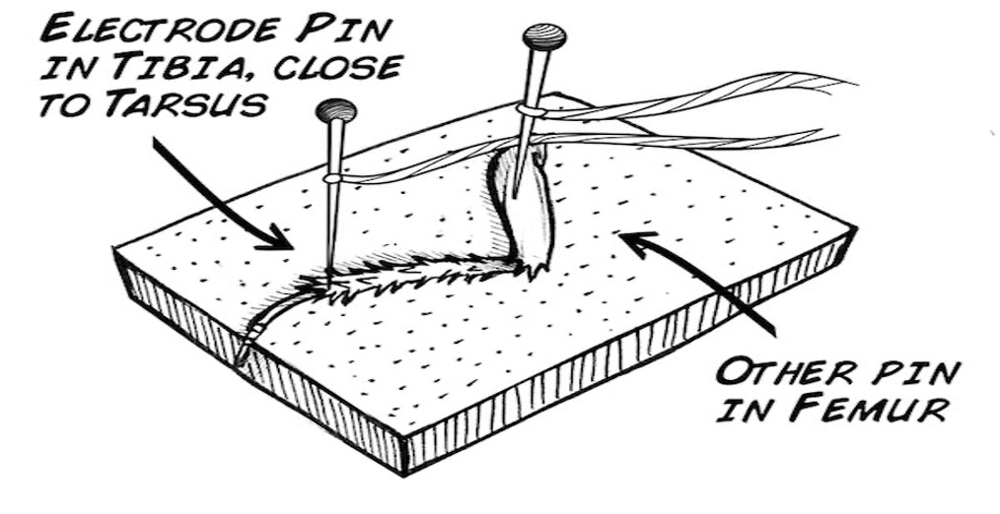
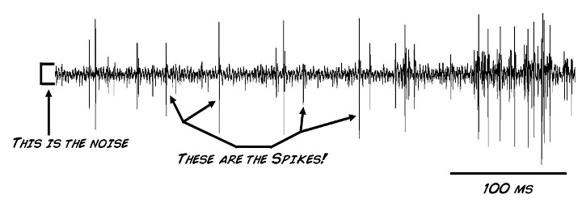
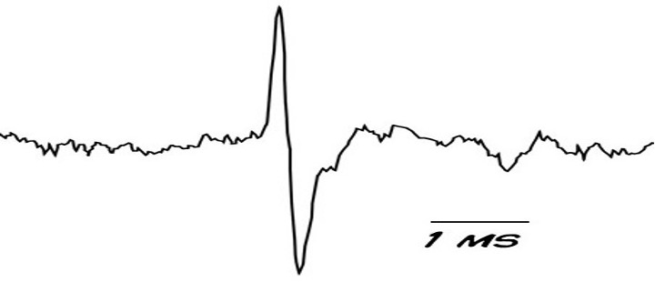

# Noisy Neurons: Activity Instructions

1. Take a cockroach and put it in a jar of ice water. Wait a few minutes until it stops moving.

2. Remove the cockroach from the ice water, and with a tug on the femur, pull off one of its legs.
   * Don't worry, the leg is designed to break easily at this joint (like the tail of a lizard) and will grow back to full size within 125 days.

3. Return the cockroach to its house.

4. Place the leg on the cork of your SpikerBox.

5. Place the two electrodes in.

6. Turn your SpikerBox on!

7. Now touch the thorns on the leg with a plastic probe or a toothpick.
   * If you hear a popcorn sound in response to the thorn manipulation, congratulations, you have just heard your first neurons spiking!

8. Now let's see what the electrical discharge looks like. Plug your smartphone cable from the Neuron SpikerBox into your smartphone/tablet.

9. Open up the SpikeRecorder app on your mobile device or computer.
   * If using a laptop, click on the USB icon that appears in the upper left screen.
   * If using a smartphone/tablet, the SpikerBox will connect automatically with the smartphone cable.

10. You should then see:

11. Zoom in, or select the *Threshold View* mode, and you will see an individual spike is all its glory.
    * This is due to sodium and potassium ion channels opening and closing in the neurons, causing this rapid change in voltage we call the spike.

## Extra Activity 1: Manual Probing with Toothpick

1. Using our downloadable form as a guide, draw a picture of the cockroach leg.
2. With a toothpick or plastic probe (coffee stirrers work great), begin touching different thorns of the leg.
   * You should notice touching some thorns causes a more robust response than other barbs.
   * Specifically, that moving the barbs near the tibia-tarsus joint causes much more robust spiking activity than that caused by manipulating the thorns near the femur-tibia joint.
3. But let's quantify it. Press the *Record* button on Spike Recorder. Tap the number 1 to signify we are on the first part of the experiment.
   * Touch a highly responsive thorn for a second, release, wait two seconds, then touch the barb again.
   * Do this so you have a total of 10 touches.
4. Now tap the number 2 on your keyboard, and begin touching a less-responsive thorn with the same procedure: 1 second on, 2 seconds off, repeat for a total of 10 times, and stop the recording.
5. Now, you will have to spike sort. Spike sorting is a way of letting your computer know what is a real neural signal and what is noise in a recording.
   * It is best to use the video as a guide to understand how to do this using our spike recorder software.
   * Measure the firing rate in 1-second segments, where you measure the firing before you touched the barb and while you touched the barb, in both the low responsive and high responsive conditions.
6. Now that have the firing rate data, using the teacher handout as a guide, we can calculate the average firing rates for when we touched the more responsive and less responsive thorns versus the spontaneous rates.
   * If you want to dive down into hypothesis testing, you can also calculate standard deviation. You can even try to run a t-test.
7. What is the main difference you observed?

## Extra Activity 2: Controlled Air Pressure Delivery

We can also do a more controlled experiment to see how different strengths of stimulation affect the cockroach leg.

You will use the compressed air on your lab bench in your school to stimulate the cockroach leg for this experiment.

If you don't have compressed air in your laboratory, home, classroom, backyard, or wherever you choose to study neuroscience, there are still plenty of ways to do this experiment. Here are some that have worked for us:
* Use a drinking straw and blow on the cockroach leg from different heights. You can tape straws at different heights to a ruler, to standardize the heights. Be sure to remind students to blow consistently during each trial.
* You can purchase compressed air in an aerosol canister at an office supply store. Compressed air is often sold in the computer section because it is used to clean keyboards and computer components. As with the drinking straw method, you can hold the compressed air canister at different heights to achieve different strengths of stimulation (you could try using a yard or meter stick and measuring at different distances).

1. Start a recording, and wait 10 seconds.
2. Now, touch the keyboard key 1 and stimulate the leg by turning on the compressed air at the lowest pressure (5 psi).
   * Use the hose to direct the compressed air at the cockroach leg.
   * Stimulate it for at least 5 seconds.
3. Touch keyboard key 2, raise the air pressure to 10 psi, and repeat.
4. Touch keyboard key 3, raise the air pressure to 15 psi, and repeat.
5. Touch keyboard key 4, raise the air pressure to 20 psi, and again...
6. Repeat for a few more increases in air pressure, stop the recording, and do the spike firing rate analysis as done above.
