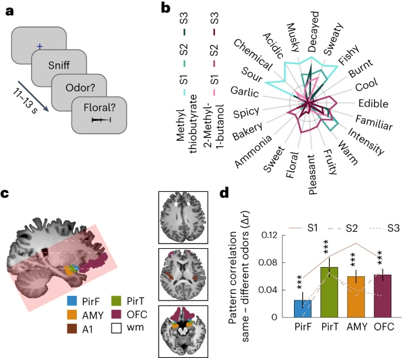
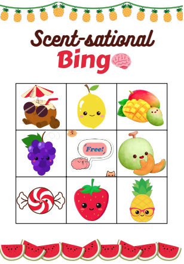

# Getting to Know your Sense of Smell: Instructions

Objectives
* To provide attendees with a general overview of the olfactory system (nose and brain)
* To educate attendees about olfactory processing
* To introduce the concept of memory storage as it relates to olfactory information

## Background

### Olfactory Perception

Your sensation of smell begins when odorant molecules travel through your nostrils and pass through the nasal cavity, an empty, air-filled space just behind the front of the skull. The odorants dissolve in the mucus covered dorsal-most portion of the nasal cavity, an area called the olfactory epithelium.

Embedded within the olfactory epithelium are olfactory receptor neurons, supporting cells, and basal cells. The olfactory receptor neurons begin processing smell. They serve as the sensory neurons for the olfactory system. The proximity of the olfactory receptors to the air make them the only neurons that are directly exposed to the outside world. Unfortunately, this allows them to encounter all sorts of dangers such as toxins, particulates, and microbes.

The axons of the olfactory receptor neurons travel through a sheet of bone called the cribiform plate before going to the olfactory bulb. In the olfactory bulb, the olfactory receptor axons terminate in discrete clusters of neurons called **olfactory glomeruli**. Each glomerulus receives input from several thousand olfactory receptor cells, all with the same receptor protein. Although there appears to be no organization of receptors at the level of the olfactory mucosa, all receptors having the same receptor protein seem to project to the same area of olfactory bulb (**chemotopic mapping**). This means in the olfactory system, you do not have a single receptor responsible for the smell of coffee for example, but it is a pattern of receptor activation that converges on the same glomeruli that “tells” your brain that you are smelling coffee.

Lastly, the synaptic connectivity between olfactory receptor neurons and the secondary neurons in the olfactory bulb (mitral cells) occurs within the glomeruli. Mitral cells collectively form an olfactory tract that sends projections to the brain for us to identify and detect the specific odorant.

### Pathway to the Brain

Neuronal axons leave the olfactory bulb via the olfactory tracts and converge directly to the **piriform cortex** (primary olfactory cortex) and **amygdala** of the temporal lobes (making olfaction the one sensory modality that gains access to the cerebral cortex without passing through the thalamus). These areas project to various parts of the **limbic system** (which is responsible for the emotional perception of odorants) and to the medial dorsal nucleus of the **thalamus**. From the thalamus, neurons also project to the **orbitofrontal cortex**, which is responsible for the conscious perception of odors.

### Sensory Memory and Olfaction

**Olfactory memory** refers to the recollection of odors. Specifically, explicit memory refers to attributing meaning to odors.

Odor-evoked memories are exceptionally vivid because the neuroanatomy of olfaction has a direct connection to the neural substrates of emotion and associative learning. Olfactory neurons have direct projections to the **piriform cortex** (also called primary olfactory cortex) and to the **amygdala**. The piriform cortex is thought to be involved in sensory features of the odor, and in simple forms of short-term memory like habituation or perceptual learning. Amygdala on the other hand is an essential component of emotion regulation and processes emotional experience and emotional memory. This direct connection to the regions related to memory and emotion is what makes us have such a strong association to certain smells that might remind us of a specific period in our lives.

The neurons from the piriform cortex and amygdala then project to other brain regions — including areas involved in memory (**hippocampus** and **hypothalamus**), as well as to the **thalamus** (a relay center in our brain). The projection from the thalamus to the **secondary olfactory cortex (the orbitofrontal cortex)** allows us to assign value to the stimuli and determine the reinforcement value. Again, these strong memory projections are why when you smell something, it often brings back memories associated with the object. **None of our other senses have this level of targeted connection with the areas of the brain that process emotion, associative learning, and memory.**

Furthermore, direct connection between the amygdala and the hippocampus, which is involved in associative learning, activates the **amygdala-hippocampal complex** and further contributes to the sensory memory as it relates to the olfaction.  The amygdala is involved in the formation of memories of emotional experiences, particularly those associated with fear, flight, and defense. The hippocampus is involved in memory, learning, and emotion. Its largest job is to hold short-term memories and transfer them to long-term storage in our brains.

**Interesting note:** The primary olfactory cortex and the hippocampus have extensive connections with the amygdala through both indirect and direct pathways. It is important for an animal to create memories of olfactory stimuli which threaten its survival. Without a properly functioning amygdala, olfactory memories would not be able to form which could put an animal at risk of dangerous stimuli in its environment due its lack of memory of such stimuli.

The sense of smell is very specific, which helps to explain how our smell memories can be so precise. Humans have more than 400 types of olfactory receptors. This allows for a large amount of olfactory detail, and our nervous system works to categorize all of that smell input.

Similarities in odor chemistry are mirrored by similarities in neural activity. Related odors produced correlated neuronal patterns in both the piriform cortex and olfactory bulb, as measured by overlaps in neuron activity. Weakly related odors, by contrast, produced weakly related activity patterns.

“The fact that we all think a lemon and lime smell similar means that their chemical makeup must somehow evoke similar or related neural representations in our brains,” - Sandeep Robert Datta

**Importantly, experience can shape the association of smell memories. As your experience changes, the actual relationships that are encoded in your brain move around.**

### Fun additional information
* When you have a cold and your nose is stuffed up, you cannot smell very well. This is because the molecules that carry smell cannot reach the olfactory receptors.
* The olfactory receptors are one of the few known populations of neurons where adult neurogenesis regularly occurs, each having a lifespan in the range of 30 days to a year. The average human olfactory system has somewhere between 6-20 million olfactory receptor neurons.
* When neurons pick up a scent, they become less sensitive to it in the short term. Many people experience this as getting used to a smell in their environment and becoming temporarily unaware of it.
* When you chew, molecules in the food make their way back to the nasal epithelium. Essentially, what you consider flavor is smell. When you are eating, all of the flavors are really smell. For example, by pinching your nose when eating something such as vanilla or chocolate ice cream, instead of tasting the flavor, all you can taste is sweet.
* In 2013, one group of scientists suggested that just as there are five senses of taste (sweet, salty, sour, bitter and umami), there are ten basic dimensions of smell, such as fruity, nutty, woody and citrus.

## Materials
* Essential oils (preferably scents that are easily identifiable)
* Cotton balls
* Test tubes
* Coffee beans to clear your nose between fragrance sniffs
* Bingo cards and chips
* Bowl/container for bingo chips

## Set-up Instructions
1. Create bingo cards associated with chosen essential oils. (BAW 2024 = fruit scents)
2. Laminate bingo cards (e.g., using self-adhesive sheets).
3. Label 2 sets of test tubes 1-8.
4. Create scent key to indicate which scent goes with which number (for volunteers, and parents if desired).

## Pre-activity Instructions (day of activity)

> [!NOTE]
> Set up 2 tubes per scent, each set labeled 1-8.

1. Place 1-2 cotton balls inside each test tube.
2. Using the scent key (FOR VOLUNTEER EYES ONLY), place a few drops of the corresponding essential oil onto the cotton balls.
3. IMMEDIATELY re-cap the test tubes.
4. Repeat for the second set of test tubes.

## Activity Instructions
1. Set up the scent test tubes, bingo cards, and bingo chips (in a bowl) on the table.
2. Spread around nose diagrams/information sheets for participants to look at.
3. ASK PARENTS ABOUT ALLERGIES PRIOR TO STARTING ACTIVITY.
   * Show parents the scent key to check if the children are allergic to anything on the board. ASK PARENTS IF THEY WOULD LIKE US TO REMOVE TUBE FROM OPTIONS. IF YES: GIVE CHILDREN A FREE SPACE AND REMOVE TEST TUBE.
4. Give each participant 1 bingo board and access to chips.
5. VOLUNTEERS OPEN TEST TUBES FOR CHILDREN.
6. Present OPEN test-tube to each child.
7. Ask the child to place a bingo chip on the corresponding scent icon.
8. Continue until children get BINGO.
   * 3 in-a-row or 3 diagonal
   * Cover the board
9. If the children get bingo = reward!

**EDUCATE:** Talk about the structure of the nose, and how it works to allow us to smell the world around us (and the scent bingo). Then talk about how this information moves from the nose to the brain. And then finally, how our memory of the world allows us to recognize these smells and correctly fill in the bingo boards (if they don’t recognize a scent, talk about how now you’ve smelled it and know what it smells like, you’ll be able to recognize it in the future).

## Take-Home Points
* Your nose is a powerful tool that uses receptors to recognize the specific odorant molecules associated with different things.
* Smells are recognized through a pattern of activation of various receptors that send projections to the brain.
* Unlike other sensory systems, olfaction has strong direct connection to brain regions associated with memory, which is why certain smells create vivid memories.

## Activity Examples

Fig. 1: Neural activity patterns in olfactory brain areas represent odor stimuli. From: [Sagar et al. (2023) Nature Neuroscience](https://dx.doi.org/10.1038/s41593-023-01414-4)

Smell activity:

