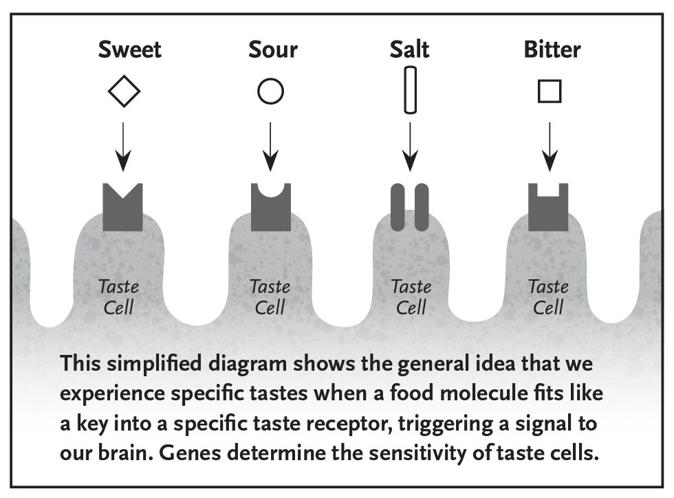
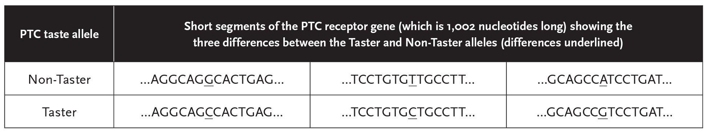
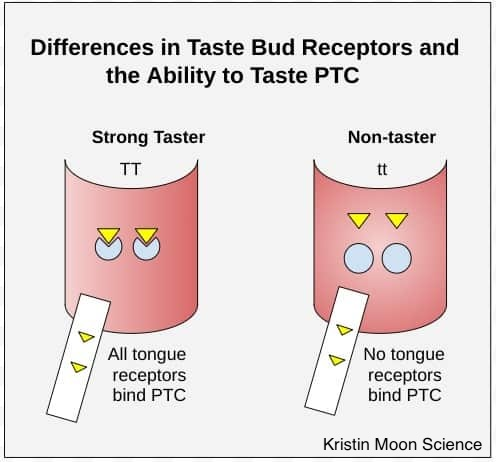

## Population Genetics of Taste Sensation

Do all people experience taste in the same way? Some people savor the flavor of beets while others grimace in disgust. What accounts for the difference?

Our sense of taste is rooted in our tongue, which is covered with **taste buds**. Each taste bud is a cluster of taste cells. Each taste cell has specific proteins on its surface that act as **taste receptors**, detecting sweet, bitter, sour, salty, or umami, a savory taste sometimes described as "meaty." These taste receptors are shaped in such a way that food molecules can fit into them. When a food molecule fits properly into a receptor, a signal is sent to our brain, and we experience a particular flavor.

Scientists are still teasing apart the many factors that can influence our sense of taste, but genes play a key role. **Genes**, generally segments of DNA that encode a protein, are transcribed into messenger RNA (mRNA), which is then translated into amino acids. Hundreds of amino acids, linked in a specific order, fold into particular 3-D structures to create **proteins**. Differences in taste-receptor genes can result in different amino acid sequences that give taste-receptor proteins different shapes. Because the sense of taste depends on food molecules fitting into taste-receptor proteins that send signals to the brain, differences in receptor shapes can result in differences in taste perception.

Genetic differences might render specific taste receptors ineffective or prevent them from forming in the first place. Individual genetic make-up determines, for example, the number of sweet receptors, the sensitivity of bitter receptors, and the brain's ability to convert sour sensory information. Your **genotype** (your specific variants of a gene) might make you crave sweets as a child but enjoy bitter flavors as an adult. Scientists are still sorting out the details.

**Taste** is different from **flavor perception**. Our sense of taste is centered on our tongue, but our perception of flavor is strongly influenced by smell. Food temperature and texture, as well as moisture in the mouth and the residual taste of food we just ate, all affect how we experience food.

Taste and flavor perception are examples of how genetics can influence our behavior. Someone with the gene for the bitter taste receptor will likely avoid bitter foods. In other words, that person's genotype is influencing their choice to avoid broccoli. However, genes do not entirely direct our behavior. We still choose what we eat based on cultural practices, available food choices, marketing, and knowledge of what's healthy and what's not. The same is true of other genetic links to behavior. For example, specific genes are linked to drug addiction, but family stability and peer groups also influence whether or not someone becomes addicted to drugs.

In this activity, participants will investigate the genetic basis of taste by testing their ability to taste the bitter compound PTC.

**Phenylthiocarbamide (PTC)** is a synthetic compound that has either no taste or a very bitter taste, depending on the person's genotype at a particular site in the genome. While PTC itself isn't found in food, related compounds are present in foods that some people find bitter, such as broccoli. This might influence food choice, although some studies have shown little correlation between PTC tasting ability and food preferences.

## Genetics underlying taste

* Genes are segments of double-stranded, complementary DNA, made of the nucleic acids adenosine (A), thymine (T), guanine (G), and cytosine (C).
* To decode DNA, the complementary strand of DNA is transcribed into messenger RNA (mRNA).
* To translate mRNA into protein, every set of three nucleic acids (called a *codon*) binds to a specific amino acid. Which codons encode which amino acids are shown in a *codon table*.
* Amino acids, in a specific sequence and 3-D structure, form proteins.
* Special proteins on the surface of taste cells on our tongue help us detect specific flavors. These proteins (which are made up of amino acids) are called taste cell receptors. Participants will test factors influencing their ability to taste and to perceive flavor.

## Genotypes and PTC tasting

* You have 2 copies (**alleles**) of each gene -- 1 from mother, 1 from father.
* The gene for PTC tasting has two variants (types of alleles), which we will represent as *T* (dominant) and *t* (recessive).
* A person's genotype for this gene can be *TT*, *Tt*, or *tt*.
* **Dominant** means that a person will be a taster if they have *one or more* copies of the *T* allele. Basically, the dominant *T* allele "masks" the non-tasting effect of the recessive *t* allele when both alleles are present.
* But this masking effect is **incomplete**, which means that generally a person with *TT* genotype will perceive PTC as more strongly bitter than a person with the *Tt* genotype (heterozygous genotype).

## Other interesting facts about PTC
* Only about half of Aboriginal peoples from Australia and New Guinea are tasters.
* Nearly 100% of Native Americans and Alaska Natives are tasters.
  - This is a good opportunity to discuss population genetics concepts like *founder effect*.
* People who can taste PTC are more likely to be non-smokers and to not be in the habit of drinking coffee or tea.
* People who are "supertasters" (can taste PTC very strongly) are more likely to find green vegetables bitter.
* Women, people of Asian descent, and African-Americans are all more likely to be supertasters.
