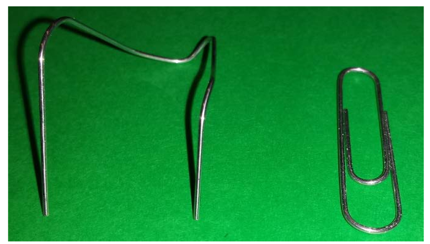

# Two-Point Discrimination: Activity Instructions

## Objectives
* Are all parts of the body equally innervated with sensory nerves?
* Would different parts of the body have the same or different two-point discrimination threshold?
* Do most people show the same pattern?

## Background

**Two-point discrimination** = the minimum distance at which two points of touch can be perceived as separate.

Within our skin are sensory neurons that are sensitive to touch. These neurons take in information from the skin and send it back up to the brain.  Each neuron has a certain amount of skin it can sense touch in, called a receptive field. **If two touches occur on separate neurons (and thus separate receptive fields), we can discriminate them as separate. If they occur within the receptive field of one receptor, we perceive this as one touch.**

Parts of our body have different numbers of receptors, which changes sensitivity to two-point discriminations. Areas such as our fingertips or lips are more sensitive than our legs or back.

**Skin can detect several types of sensations:** Information from our skin allows us to identify several distinct types of sensations, such as tapping, vibration, pressure, pain, heat, and cold. Human skin contains different kinds of **sensory receptors** (cells) that respond preferentially to various mechanical, thermal, or chemical stimuli. (The word "receptor" can mean a receptor cell or a membrane receptor in a cell. Here, it refers to a cell.)

These receptors convey this information to the brain and spinal cord, also known as the **central nervous system (CNS)**, to areas where we perceive the stimuli. To accomplish this, the nerve endings of the sensory receptors transduce, or convert, mechanical, thermal, or chemical energy into electrical signals. These electrical signals then travel along neuronal extensions called **axons**, to the CNS.

Finally, the way we interpret or understand sensations is shaped not only by the properties of receptors and neurons, but also by previous experiences that are stored in our brains.

In this lab, activities involve the **tactile or touch sense** of the skin, which allows us to distinguish different kinds of stimuli on the surface of the body. By using our tactile sense, we detect superficial and deep pressure and sensations we describe as brushing, vibration, flutter, and indentation.

**Sensory input is mapped onto specific brain areas:** Information from each skin receptor is carried along a pathway formed by several neuronal axons to a strip on the top of the brain surface called the **somatosensory cortex**. The somatosensory cortex is packed with the cell bodies of CNS neurons, which receive "skin input" from all parts of the body via the "touch-neuron pathway."

Sensory input pours into the CNS neurons in a topographically faithful manner. This means, for instance, that the CNS neurons receiving input from sensory receptors in the right thumb will have neighbor cells that receive input from the right index finger. These, in turn, will have neighbors receiving input from the next finger, and so on. In this way, a sensory "map" of the body surface is created on a section of the brain surface.

From the somatosensory cortex, messages about sensory input are sent to other brain areas; for example, to motor areas for use in performing actions, and to higher processing areas, for making decisions or enjoying sensations or reflecting on them.

**Receptor density and the sizes of receptive fields of central neurons determine two-point discrimination ability:** The two-point threshold distance on the fingertips is two to three millimeters (mm). In other words, the receptors must be packed closely enough so that a probe stimulates one or more of them. High receptor density alone, however, cannot explain why the fingertip can distinguish points so close together while the arm senses two points only when they are 35 to 40 mm apart.

Each sensory receptor connects through a series of relay neurons with a CNS neuron. A given central neuron responds to all information from its input area (the skin area that is the gathering field for only that CNS cell) as if it were coming from one point. This skin area is called the **receptive field** of the central neuron.

On the arm, each sensory receptor gathers information from a much larger skin area than a receptor on the fingertip, and this receptor is also connected to a defined central neuron. This central neuron, like the central "finger neuron", interprets all input as coming from one point, even though the skin area in this case is much larger.

In order for a person to feel two points, two separate central neuronal populations must be activated by stimulation of their respective receptive fields. When this happens, two points are reported.

**To summarize**, two-point discrimination depends on activating two separate populations of neurons, and in order to discriminate between two closely placed points, the receptive fields of the neurons must be small. This in turn means that the receptors must be densely packed in a sensitive area, so that two points very close together activate different receptors.

## Materials 

Materials per group
1. Ruler
2. Paper Clips
3. Note Cards
4. Writing Utensil
5. Tape
6. Optional: Discrimination Threshold Chart

## Materials Preparation

This may already be complete - see kit

1. Bend the paper clip as shown in the photo (into a shape of a U)
2. Use a ruler to make tips of paperclips at 2cm, 1cm, 0.5cm, and 0.2cm
3. Tape paper clips to notecards, one per side

## Activity Instructions

1. Have the subject close their eyes so that they cannot see the paperclips touch the skin.
2. Start with the wrist and place the two points of the paperclip as close together as possible and touch the skin.
   * It is important to touch the skin with the two ends of the paper clip simultaneously with the same pressure.
3. Have the subject indicate how many points of the paper clip they can feel.
   * If they feel 2 points, move the ends of the paperclip closer together and repeat the procedure.
   * If they feel 1 point, have your partner increase the distance between the ends slightly and repeat the procedure.
4. Continue this until you find the distance between the points that always gives the sensation of having 2 points touch the control location, but if this distance is reduced, it only feels like a single point. This is the TWO-POINT discrimination threshold.
5. Optional: Record the two point discrimination threshold in the chart.
6. Switch roles with your partner and repeat.

## Take-Home Points

* The sense of touch comes from neurons that have receptors on your body.
* The receptors are closer together on the finger than on the back of the arm!

## Activity Examples 

