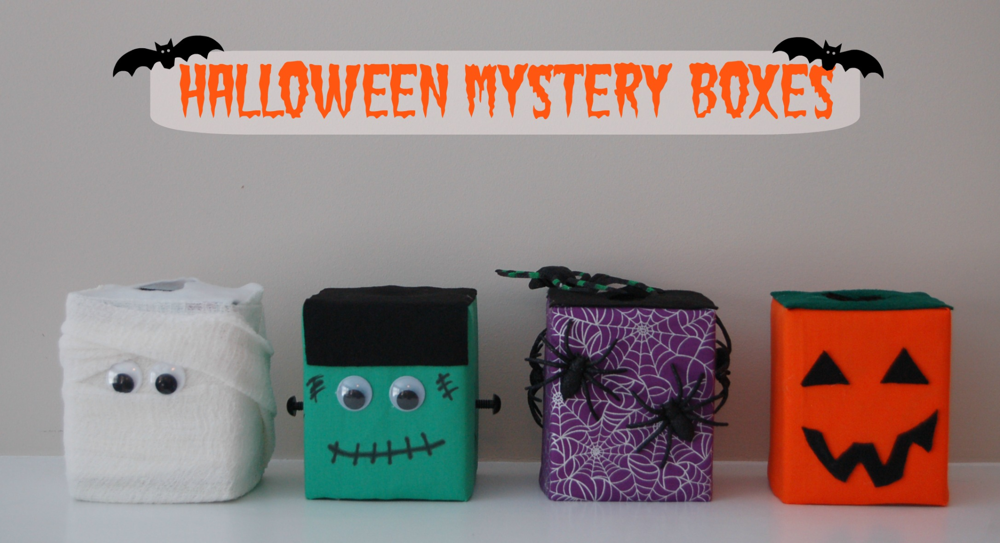
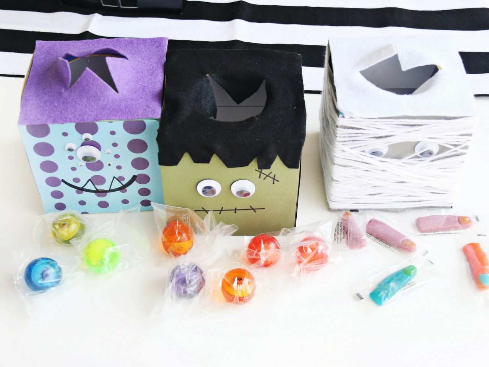
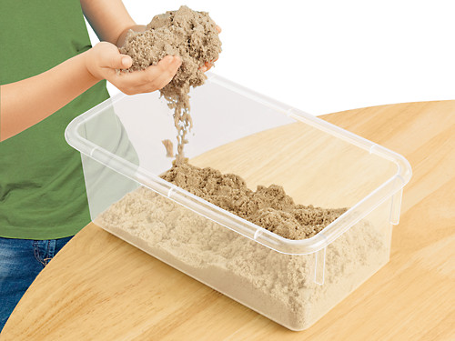
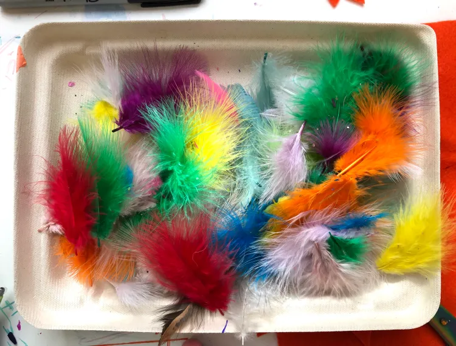

# Mystery of Touch

## Objectives

1. Participants will explore their sense of touch and develop a better understanding of their different touch receptors and how they help them to navigate in our day to day world.
2. Participants will understand how the touch-related information is transmitted to and from their brain.
3. Participants will understand tactile recognition as it relates to learned information.
4. Participants will use creative thinking and imagination to associate the touched object within the box with an outlined character.

## Background

Touch is one of the five primary senses that belong to the somatosensory system, and it allows us to interact with the environment around us through physical contact.

### Touch receptors

Touch is perceived through five different cutaneous (related to the skin) receptors: free nerve endings, Pacinian corpuscles, Meissner’s corpuscles, Merkel disks, and Ruffini endings.

These receptors are responsible for the detection of different stimuli, including pain, temperature, skin displacement, light touch, skin indentation, and skin stretch.

### Touch to brain

Stimulation of the touch receptors results in the generation of action potentials within the sensory nerve. The sensory nerve is made up of nerve fibers that connect to the spinal cord in the region called spinal dorsal horn.

These action potentials reach the spinal dorsal horn via Aβ (touch) fibers, or Aδ and C fibers (pain). Once the neurons within the dorsal horn are activated, touch-related information will then travel to the somatosensory cortex of the brain. The somatosensory cortex is located in the parietal lobe, near the postcentral gyrus.

The somatosensory cortex is somatotopic (i.e., organized according to a map of the body surface). Additionally, each region of the somatosensory cortex has a different quantity of innervating neurons, which influences how sensitive different parts of the body are (e.g., our fingers are able to distinguish specific objects, much better than our elbow).

Touch-related information is communicated to the somatosensory cortex via two different pathways: the dorsal-column medial-lemniscus system and the anterolateral system. The dorsal-column system is responsible for precise touch and proprioception, while the anterolateral system relays information regarding pain and temperature.

### Sensation encoding

The somatosensory system not only allows our brain to recognize the sensation of touch, but also plays an important role in tactile recognition. **Tactile recognition** refers to the ability to identify common objects through touch without seeing an object. This ability to recognize objects with only touch, is achieved through haptic memory.

**Haptic memory** involves tactile sensory memories procured via the sense of touch through the sensory receptors, which can detect sensations such as pain and pressure. This allows us to combine a series of touch sensations and to identify objects we can’t see. Similar to the touch receptors, tactile memories are organized somatotopically, following the organization of the somatosensory cortex. However, this recognition is strongly related to the learned information, where if we were never learned what a key is, we would not be able to recognize this object since we were never exposed to this object.

## Materials

> [!IMPORTANT]
> All objects inside the mystery box and/or sensory bin need to be easily identifiable!

**Touch Sensation Boxes (activity about the types of touch receptors)**

* Plastic bin(s) - use large bin for wet sand
* Receptor-related items:
  - Pain - toy jacks
  - Temperature - ice cubes/ice packs and hand warmers (heating pad)
  - Light touch - feather
  - Pressure - wet sand
* Hand wipes for wet sand

**Mystery Touch Boxes (activity about sensation encoding)**

* 4 Boxes - large enough to stick hands inside
* Craft materials to decorate (based on choice of characters)
* Touch materials for inside boxes (based on choice of characters)
* White board + white board markers
* Paper + writing utensils (optional)
* Step-stool (if needed - based on age group and table set-up)
* Candy for participants who identified X number of items (optional)

## Activity Instructions

### Touch Sensation Boxes (types of touch receptors)

*Pre-activity (set-up)*
1. Fill each of the plastic bins with the respective receptor-related items.
   * Bin 1 = hot & cold items 
   * Bin 2 = feathers
   * Bin 3 = sand
2. (optional) Decorate each bin in relationship to the chosen items.
3. Print flyers indicating each of the touch receptors to place behind the bins.

*Activity*
1. Place bins on table for participants to access.
2. Have the participants use their hands to feel the different objects and work their way through each of the sensation boxes.
   * If the participants are interested, ask them to apply the objects to a more distant body part (i.e. shoulder)
3. As they are touching the items, have them describe what they are feeling.
   * Why are you feeling hot/cold?
   * What do you feel when you have your hand in the heavy sand?
   * How different is it from the stroke of a feather on your skin?
   * Why do you think you can feel all of these objects differently?
   * If these objects touched different parts of your body (e.g., elbow or foot) do you think it would feel differently? Why do you think that is?
4. EDUCATE: Talk about the different receptor types you have throughout your body, and how they allow us to feel these different sensations (pain, temperature, light touch, and pressure). If the object was applied to multiple body parts, talk about somatosensory cortex and how your brain is able to recognize the sensation from various body regions (also sensitivity of different body parts).

### Mystery Touch Boxes (sensation encoding)

*Pre-activity (set-up)*
1. Choose characters to represent each of the touch boxes.
2. Choose materials to place inside of the boxes that are related to each of the characters.
3. Cut a hole in the side of each box (large enough to fit a hand through, but small enough to prevent participants from seeing the materials inside).
4. Cut flaps of felt to place around the hole (to help disguise the items inside).
5. Decorate each box based on choice of characters.
6. Place chosen materials inside each of the boxes.
7. Write down what each material is exactly, and how it relates to the character (instructor key for childrens answers - think of multiple options).

*Activity*
1. Place each of the touch boxes on a table.
2. Say: "Use these characters to help you figure out what item is inside the boxes."
3. Have the children one-by-one stick their hand inside the first box.
4. Let the children touch the items inside for a few seconds.
5. Have the children guess what the item is.
   * Instructors can use whiteboards to keep track of their answers.
   * (Optional) Have children write their answers for each box on a sheet of paper and submit after the last box.
   * (FUN optional addition) Have children guess how the item inside the boxes relates to each of the characters.
6. Repeat for each box.
7. EDUCATE: Talk about haptic memory and tactile recognition. Explain how we are able to use touch alone to recognize objects and how learning is involved in this.
8. (optional) Based on the number of correct answers - have prize box with candy (choose level of "correctness" that results in a win).

## Take-Home Points

**Touch Sensation Boxes (types of touch receptors)**
* Your body has a variety of touch receptors in your hand (and throughout the rest of the body) which allows you to feel things (and interact with the world).
* Each type of receptor recognizes different aspects of touch (e.g., pain, temperature, light touch and pressure).
* These receptors communicate to the brain (somatosensory cortex) which allows us to cognitively recognize the type of sensation and location of the body being touched.

**Mystery Touch Boxes (Sensation Encoding)**
* The communication between touch receptors and the brain, allows for a process called tactile recognition, in which we can recognize objects only through touch.
* Tactile recognition is accomplished through a process known as Haptic Memory, in which the brain connects touch sensations with previously learned information to identify objects based only on their physical characteristics. For example, being able to identify cotton balls or pipe cleaners, requires previous exposure to these objects.

## Activity Examples

