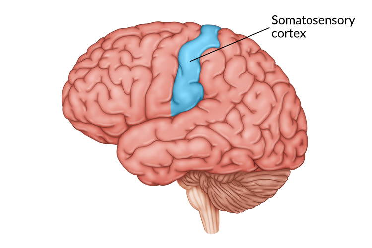
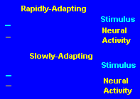
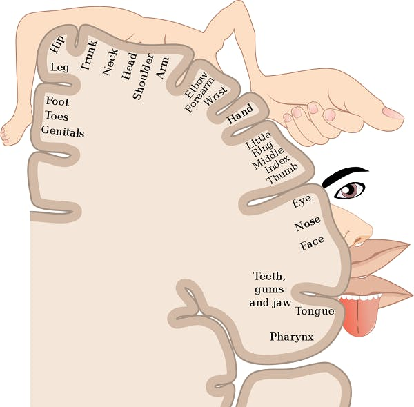

# Two-Point Discrimination: Background Information

**Two-point discrimination** = the minimum distance at which two points of touch can be perceived as separate.

Within our skin are sensory neurons that are sensitive to touch. These neurons take in information from the skin and send it back up to the brain.

Each neuron has a certain amount of skin it can sense touch in, called a receptive field. **If two touches occur on separate neurons—and thus separate receptive fields, we can discriminate them  as separate. If they occur within the receptive field of one receptor, we perceive this as one touch.**

Parts of our body have differing amounts of receptors, which changes sensitivity to two point discriminations. Areas such as our fingertips or lips are more sensitive than our legs or back.

Because information is sent back to the brain, there is a section of the brain dedicated to integrating sensory information (called the **somatosensory cortex**).

## 1. Skin can detect several types of sensations

Information from our skin allows us to identify several distinct types of sensations, such as tapping, vibration, pressure, pain, heat, and cold.

What is it that allows us to make these distinctions?

First, human skin contains different kinds of **sensory receptors** (cells) that respond preferentially to various mechanical, thermal, or chemical stimuli. (The word "receptor" can mean a receptor cell or a membrane receptor in a cell. Here, it refers to a cell.)

Next, these receptors convey this information to the brain and spinal cord, also known as the **central nervous system (CNS)**, to areas where we perceive the stimuli.

To accomplish this, the nerve endings of the sensory receptors transduce, or convert, mechanical, thermal, or chemical energy into electrical signals. These electrical signals then travel along neuronal extensions called **axons**, to the CNS.

Finally, the way we interpret or understand sensations is shaped not only by the properties of receptors and neurons, but also by previous experiences that are stored in our brains.

In this lab, activities involve the **tactile or touch sense** of the skin, which allows us to distinguish different kinds of stimuli upon the surface of the body. By using our tactile sense, we detect superficial and deep pressure and sensations we describe as brushing, vibration, flutter, and indentation.

As mentioned above, our skin is also sensitive to temperature and pain, which we sense with different sets of receptors. These skin senses, along with muscle/joint position awareness (**proprioception**), make up the somatic senses.

## 2. Sensory information forms the basis for our connection to the outside world

How do we use somatosensory information?

Brainstorm with students for ideas and see if they include the following: exploring, evaluating, and enjoying our environment; making decisions about what to wear or where to set the thermostat; keeping ourselves awake and alert; using as feedback for controlling our movements; avoiding harm from hot, cold, or damaging substances. (Note that some of these involve the tactile sense while others involve the pain, temperature, and proprioceptive senses.)

The somatic senses and the sense of taste put us in direct contact with our environment, while vision, hearing, and smell gather information from a distance. Other special internal senses include balance, detecting blood pressure, and sensing blood oxygen levels.

## 3. Different kinds of tactile receptors respond to distinct types of information

The tactile system, which is activated in the two-point discrimination test, involves several types of receptors.

A **tactile sensory receptor** can be defined as the peripheral ending of a sensory neuron and its accessory structures, which may be part of the nerve cell or may come from epithelial or connective tissue. Different kinds of receptors respond to different kinds of stimulation, such as vibration, pressure, or tapping, and convert these into electrical signals.

Table 1 shows a few types of skin receptors, the kinds of input they detect, and their **adaptation rate** when stimulated.

Slow-adapting receptors continue sending impulses to the brain for a relatively long time when a constant stimulus is applied.

Fast-adapting receptors fire at the time a stimulus begins and sometimes again when it is removed, but they do not continue firing in response to a constant stimulus.

Having receptors with different preferences and different "reporting" capabilities allows us to tune in more acutely to our environment and to distinguish a wide variety of sensations.

## 4. Sensory input is mapped onto specific brain areas

Information from each skin receptor is carried along a pathway formed by several neuronal axons to a strip on the top of the brain surface called the **somatosensory cortex**.

The cortex or "rind" is the cell body-containing outer layer of the brain and is about six millimeters, or one-quarter inch, thick.

The somatosensory cortex is packed with the cell bodies of CNS neurons, which receive "skin input" from all parts of the body via the "touch-neuron pathway."

Sensory input pours into the CNS neurons in a topographically faithful manner. This means, for instance, that the CNS neurons receiving input from sensory receptors in the right thumb will have neighbor cells that receive input from the right index finger. These, in turn, will have neighbors receiving input from the next finger, and so on. In this way, a sensory "map" of the body surface is created on a section of the brain surface.

Neurologists discovered this years ago when they found that they could produce the illusion of sensation in, say, a finger, by electrically stimulating the appropriate spot on the somatosensory cortex: the CNS neurons interpreted the artificial electrical stimulus as input coming from the finger that usually sent it information.

From the somatosensory cortex, messages about sensory input are sent to other brain areas; for example, to motor areas for use in performing actions, and to higher processing areas, for making decisions or enjoying sensations or reflecting on them.

## 5. Sensory maps in the cortex are "distorted"

Although tactile sensory maps in the cerebral cortex are faithful to the locations of the sensory receptors, they do not reflect the correct proportions of the skin areas.

Rather, the cortical area devoted to receiving information from a spot on the skin reflects the density of sensory receptors there, and this number in turn reflects the importance of that body area for gathering information.

The fingertips, for example, contain about 100 times more receptors per square centimeter than the skin on the back.

Because of this, more CNS neurons must be devoted to receiving fingertip sensations, and consequently the cortical area that receives input from the fingertips is huge compared to the area that receives input from skin on the back.

If pictures of the parts of the body are drawn next to their corresponding brain areas, the fingers are very large and the arms and back are small. This type of picture is called a homunculus, literally, "little man" or person.

All sensory systems feed information into the cerebral cortex in orderly maps, even though the other peripheral sensory receptors, unlike those of the touch or tactile system, are concentrated in small organs: eyes, ears, nose, and tongue. Information from each of these senses is mapped onto a different brain area.

## 6. Receptor density & size of receptive field of central neurons determine two-point discrimination ability

What properties of the touch sensory system allow us to discriminate between two points pushing on our skin even when they are only 2 or 3 mm apart?

One of the necessary properties is **high receptor density**, and the class should discuss this after students find that the two-point threshold distance on the fingertips is two to three millimeters (mm). In other words, the receptors must be packed closely enough so that a probe stimulates one or more of them. High receptor density alone, however, cannot explain why the fingertip can distinguish points so close together while the arm senses two points only when they are 35 to 40 mm apart.

The second property necessary for fine two-point discrimination is that neighboring receptors must connect to different CNS neurons, which in turn means that these CNS neurons must have **small receptive fields**, as explained below.

Each sensory receptor connects through a series of relay neurons with a CNS neuron. A given central neuron responds to all information from its input area (the skin area that is the gathering field for only that CNS cell) as if it were coming from one point. This skin area is called the **receptive field** of the central neuron.

On the arm, each sensory receptor gathers information from a much larger skin area than a receptor on the fingertip, and this receptor is also connected to a defined central neuron. This central neuron, like the central "finger neuron", interprets all input as coming from one point, even though the skin area in this case is much larger.

In order for a person to feel two points, two separate central neuronal populations must be activated by stimulation of their respective receptive fields. When this happens, two points are reported.

**To summarize**, two-point discrimination depends on activating two separate populations of neurons, and in order to discriminate between two closely placed points, the receptive fields of the neurons must be small. This in turn means that the receptors must be densely packed in a sensitive area, so that two points very close together activate different receptors.

## 7. Sensory information from different receptors is combined at higher brain levels

Although individual receptors respond to only one type of stimulus, such as pressure or vibration, a stimulus in the real world almost always activates several kinds of receptors simultaneously.

To form a representative picture of this in our minds, the different sensations must all "get together" somewhere in the brain, and one place this happens is in cortical neurons called feature-detecting neurons.

These neurons each receive several different types of information from neurons in the primary somatosensory cortex (which received their information from receptors).

This integration of sensations allows us to experience an ice cube as both smooth and cold, or to feel that sand at the beach contains different sized grains and may be hot or cool.

As this information is sent to higher brain centers, sensations also take on meaning because of past experiences.

## 8. Neurologists use two-point discrimination tests to check for nerve damage

Neurologists, doctors who specialize in diseases of the central (brain and spinal cord) and peripheral (nerves to all the organs and muscles) nervous systems, sometimes test patients for two-point discrimination. They may do this if they suspect a problem with sensory information entry to the skin, the pathways to the brain, or the interpretation of sensory information.

For example, if a patient has cut a finger badly, a neurologist may test for two-point discrimination at the time of injury to see if the nerve was cut.

After the original injury has healed for a number of weeks, the neurologist will again test two-point discrimination and compare it with the normal fingers to see if the nerve has regenerated.
