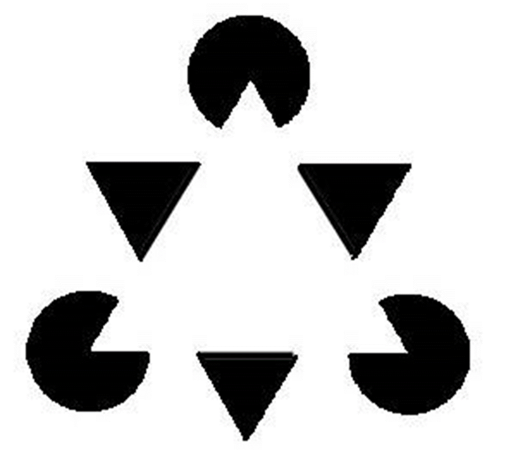
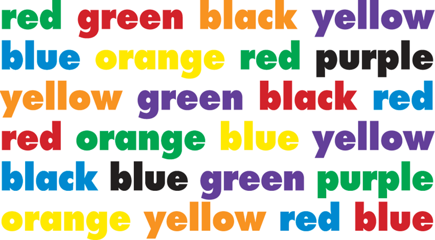
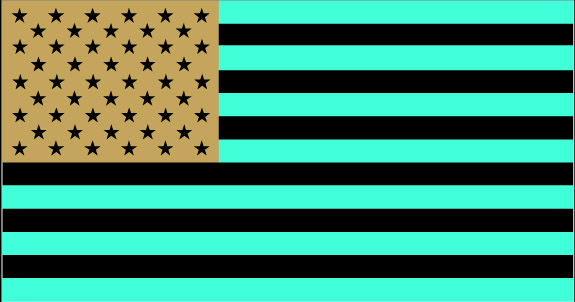
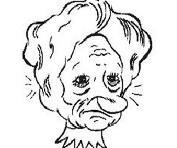
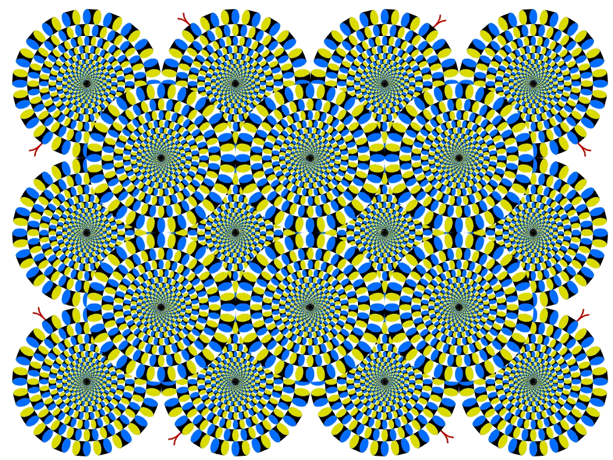

# Illusion Confusion

## Objectives
* This activity provides an engaging and educational experience to deepen understanding of the intricate workings of perceptions.
* Educates on the structure and function of the eye and brain and how they work together.

## Background

This activity aims to educate participants about how the eyes and brain collaborate to interpret visual information. It introduces the concept of **optical illusions**, demonstrating how our perception can sometimes differ from reality. Through interactive slides and audience participation, the activity explores various types of illusions related to shapes, colors, and afterimages. By engaging in demonstrations and discussions, participants learn about the fascinating ways in which the brain processes visual stimuli and can sometimes misinterpret what we see.

**Kaniza Triangle Illusion:** Involves perceiving a white triangle against a background, even though a triangle itself is not physically present. Gestalt psychologists use the Kanizsa Triangle to describe the law of closure, which claims that objects grouped together are seen as a whole. This means that we perceive objects as being whole even when they are incomplete; we ignore gaps and we complete contour lines to form familiar figures and shapes.

**Stroop Effect:** This effect demonstrates the interference between different information received by the brain. There are two theories that may explain the Stroop effect:
* Speed of Processing theory: the interference occurs because words are read faster than colors are named.
* Selective Attention theory: the interference occurs because naming colors requires more attention than reading words.

**Afterimages:** After staring at a specific image or color for a prolonged period, the receptors in the retina become desensitized to that stimulus. When looking away, the overstimulated receptors may produce an afterimage, where the complementary color or image persists temporarily in the field of vision.

**Face Illusion:** This illusion involves perceiving different faces depending on the orientation of the image. For instance, an image may appear to depict either a young or elderly woman, depending on the viewer's perception. The brain's interpretation of facial features can be influenced by various factors, including the viewer's age and prior experiences.

**Peripheral Movement Illusion:** In this illusion, objects in the periphery of vision appear to be in motion, even though they are stationary. This effect occurs due to the brain's interpretation of peripheral visual cues and the frequency of tiny eye movements, which can create the perception of movement.

**Hermann Grid Illusion:** This illusion involves perceiving ghost-like grey blobs at the intersections of a grid on a contrasting background. The grey blobs disappear when directly fixating on an intersection. The illusion arises from the interaction between light and dark areas in the visual field, leading to perceived discrepancies in brightness.

**Adelson's Same Color Illusion:** In this illusion, two squares of identical color appear to be different due to the surrounding context. For example, a square surrounded by lighter blocks may appear darker than an identical square surrounded by darker blocks. This phenomenon occurs because the brain interprets colors relative to their surrounding context, leading to perceptual discrepancies in brightness and shading.

## Materials

Illusion confusion demonstration slideshow presentation or poster

## Activity Instructions

**SLIDE 1 [Title Slide - Covered]**
1. Ask the audience to read SLIDE 1.
   * They will most likely say it says "Illusion Confusion at McWane Science Center"
2. Tell them to keep that in mind and we’ll come back to this slide later.

Then, have the audience define *optical illusion*.
1. You can lead them to the answer by breaking it down:
   * What does *optical* mean? (vision)
   * What is an *illusion*? (something that looks like something different from what it is)
2. **An optical illusion is something that "tricks" the human visual system into seeing something that isn’t there or seeing it incorrectly.**
3. What do we use to see?
   * Get answers from the participants. (eyes, nerves, brain)

**SLIDE 2 [Parts of the Eye]**
1. Focus mainly on the lens (focuses light), retina (nerve tissue that an image is focused onto) and optic nerve (carries message to the brain).
2. Have the participants tell you about the image and what happens to it after the light (image) passes through the lens.
   * The image is inverted.
3. Point out the optic nerve and that it "takes up part" of the retina.
   * This nerve carries the information to the brain.
4. Where the optic nerve comes off of the retina is called the *blind spot*.
   * Everyone has a blind spot.

**SLIDE 3 [The Brain]**\
The brain is where we interpret the light that comes into the eye. The brain puts together the nerve impulses from the optic nerve, flips the image right-side up, and allows us to see.

**SLIDE 4 [The Brain - Continued]**\
Show where the optic nerve comes into the brain.

**SLIDE 5 + 6 [Title Slide]**
1. Remember this slide? Ask participants why they are seeing "Illusion Confusion at McWane Science Center".
   * Our brain is filling in the covered parts of the letters to form words that make sense.
   * The eyes and the brain work together to make us see optical illusions, but past experiences also play a part in it as well.
   * Our brains will fill in gaps to try to make sense of something that doesn’t.
2. Uncover the words on the slide [SLIDE 6] and talk about the fact that sometimes not having all the information leads you to the wrong conclusion.

**SLIDE 7 [Triangle Illusion]**
1. Ask the audience...
   * Who sees a black triangle?
   * a black circle?
   * a large white triangle?
2. Then tell them that the white triangle is really not there and is created in our mind by filling in the edges of the imaginary triangle.
3. This is known as the **Kanizsa Triangle illusion**
4. Gestalt psychologists use the Kanizsa Triangle to describe the law of closure, which claims that objects grouped together are seen as a whole.
   * This means that we perceive objects as being whole even when they are incomplete; we ignore gaps and we complete contour lines to form familiar figures and shapes.

**SLIDE 8-10 [Word Colors]**
1. Call two volunteers from the audience. Have them face the audience.
2. Ask the first volunteer to read the words on the slide.
3. Go to SLIDE 9
4. Have the second volunteer say the color of the word (not read the words).
   * It should take the second volunteer much longer to get through all of the words.
5. Go to SLIDE 10
6. This is called the **Stroop effect**.
   * The Stroop effect is named for J. Ridley Stroop who discovered this strange phenomenon in the 1930s.
   * The interference between the different information (what the words say and the color of the word) your brain receives causes a problem.
7. There are two theories that may explain the Stroop effect:
   * Speed of Processing theory: The interference occurs because words are read faster than colors are named.
   * Selective Attention theory: The interference occurs because naming colors requires more attention than reading words.

**SLIDE 11 to 13 [Flag]**
1. Have participants stare at the flag image for about 45 seconds.
2. Go to SLIDE 12
3. Give the participants a couple of seconds and then ask them what they see.
   * They should see a red, white, and blue flag.
   * There is also a laminated card for each station for them to test out later.
4. This effect is called an **afterimage**.
5. Go to Slide 13
   * In the retina of your eyes, there are three types of color receptors (cones) that are most sensitive to red, blue, or green.
   * When you stare at a particular color for too long, these receptors get "tired" or "fatigued."
   * When you then look at a different background, the receptors that are tired do not work as well.
   * Therefore, the information from all of the different color receptors are not in balance.
   * So you see the color afterimages.

**SLIDE 14 + 15 [Face Illusion]**
1. Ask the audience what they see.
2. Then click to initiate animation and ask again.
3. Emphasize that the image is the same and not changed other than being rotated.
   * The difference in perspective is what creates the perception of the old versus the young women.
4. Go to SLIDE 14
5. What about now?
   * This is another common example of the same illusion as the previous slide.
6. Interesting fact: A *research study* conducted at Flinders University in 2018 found that the perception of the young or elderly woman in the image was influenced by the age of the person viewing the illusion.
   * Participants between the ages of 18-30 were far more likely to initially see the young woman, while participants over 30 were more likely to initially perceive the older woman.
   * The study concluded that the phenomenon of own-age bias has a significant impact on the subconscious perception of faces.

**SLIDE 16 [Circles]**
1. Ask the audience what they see.
   * They should see a bunch of moving circles.
2. Have participants look straight ahead, hold hands up beside the face, and wiggle their fingers.
3. Ask them if they can see their fingers moving even though they are looking straight ahead.
4. This demonstrates a **peripheral movement illusion**.
   * What makes this illusion so interesting is the fact that you are experiencing movement in the periphery although you soon come to realize that the moving objects are not moving at all.
   * While the peripheral vision demonstrates movement over the entire field of the display, focusing on one particular part of the display shows that it is stationary.
   * The speed of the perceived motion depends on the frequency of your tiny eye movements.

**SLIDE 17 [Black Squares]**
1. Does anyone see the small gray squares between the black squares?
   * The reason why you see this is because the difference in contrast between the white background and the black squares creates the illusion of the small gray squares.
2. This demonstrates a **Hermann grid illusion**.
   * An optical illusion characterized by "ghost-like" grey blobs perceived at the intersections of a white (or light-colored) grid on a black background.
   * The grey blobs disappear when looking directly at an intersection.

**SLIDE 18 [Black Dots]**
1. Can you count the black dots between the squares below?
2. Let the audience attempt for a few seconds - then interrupt.
   * It’s an impossible task.
   * Each time you move your eyes and focus, you see that the dots in the center of your receptive field are all actually white.
   * The surrounding ones just appear to be black.
3. This is another example of the Hermann grid illusion (like the gray squares in the previous slide)
4. So why do you see black dots?
   * The visual system processes *edges* of objects so that they are enhanced.
   * Seeing edges is very important for the brain’s ability to understand and define an image.
   * This sometimes leads to visual artifacts away from the center of the receptive field, such as the black dots in the Hermann grid.

**SLIDE 19 + 20 [The Dress]**
1. How many of you have seen a picture of this dress in the last few years?
   * What color is the dress?
2. Uncover the alternative shades of the dress and discuss how there was a controversy about whether the dress was *white & gold* or *black & blue*.
3. Go to SLIDE 20
4. This is that same dress. Why did some people see *white & gold* while others could see that it was really *black & blue*?
   * It’s actually a similar phenomenon to the gray squares we saw earlier.

**SLIDE 21 [Square Shadows]**
1. To explain it, let’s look at this image.
   * Raise your hand if you think Square A is darker than Square B.
   * If you think Square A is lighter than Square B?
   * If you think they’re the same color?
2. Uncover explanation...
   * They’re actually the same color!
   * However, because A is surrounded by lighter blocks, it looks darker than B.
3. This is known as **Adelson’s same-color illusion**.
   * What’s amazing about this illusion is that even after you learn that the 2 squares are the same color, your brain continues to perceive square A as significantly darker than square B.
4. Why can’t we see the colors as they actually are, even after we’ve been told and shown that they’re the same?
   * It largely has to do with our brain’s ability to interpret a 2-D drawing as a 3-D representation.
   * We expect the cylinder to cast a shadow on the checkerboard, and because we are used to compensating for shadows in real life, we perceive and compensate for the shadow we assume has been created by the cylinder.
   * However, the creator of the image has manipulated the colors and the shadow to give the illusion of the shadow, *without* there actually being a realistically rendered or predictable shadow.
   * In addition, because we interpret a checkerboard pattern in an expected way (alternating light and dark squares), due to the respective positions of squares A and B, our brains automatically categorize square A as a dark square and square B as a light square, despite their actual color.

**SLIDE 22 + 23 [Dress Continued]**\
The same thing is happening with the dress. On a dark background, the dress looks white & gold because our eyes emphasize contrast.

## Take-Home Points

Explicit takeaways:
1. Brains are LAZY (I like to say *efficient*.)
2. They make shortcuts when full knowledge isn’t available.
3. You use what you know about the world to make guesses about what is in it.
4. Shortcuts are sometimes helpful, but illusions happen when they aren’t.

Implicit takeaways:
1. You did experiments on yourself!
2. We learn new things in science based on a combination of the experiments we do plus the data we already know about the world from previous experiments.

## Activity Examples

