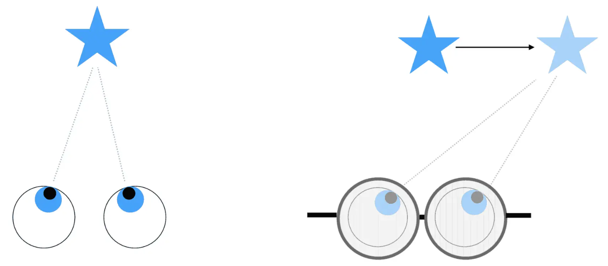
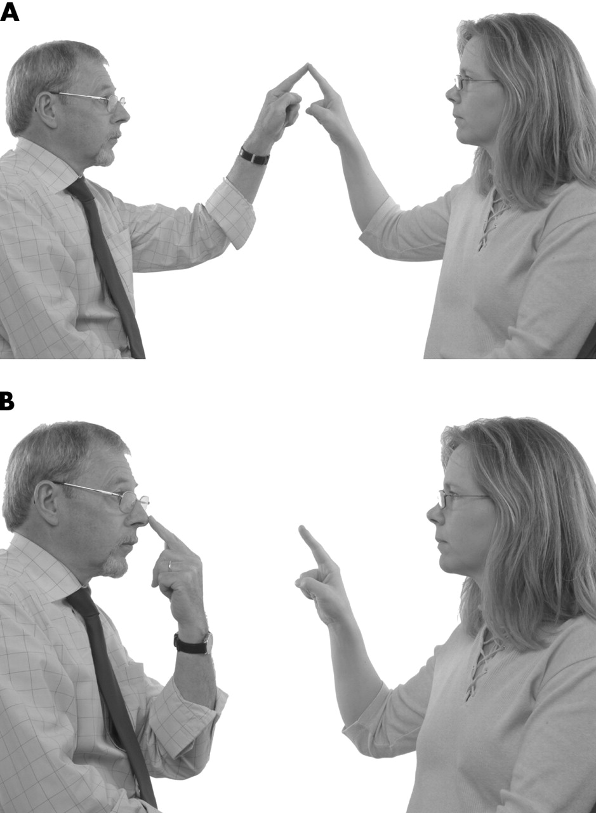

# Prism Goggles: Visual Adaptation and Neural Plasticity

## Objectives

* Learn that the brain holds a "map" of how information from your eyes corresponds to information from your muscles (proprioception; "hand-eye coordination").
* Show how sensory input and behavioral output can be modified over the course of a few trials. (Another way to say this is that your hand-eye coordination map can be changed!)
* Learn that plasticity is the brain's ability to adapt to environmental changes or new experiences.
* Learn that the cerebellum is important for short-term adaptation.

## Background

This hands-on activity introduces the visual and motor systems and shows how our brain -- especially our cerebellum -- helps us adapt quickly to different scenarios.

The lesson should emphasize the concepts of **plasticity**, which is the ability of neural pathways in the living brain and nervous system to change in response to experience or injury, and of adaptation, which is the ability to change in response to incoming signals or experience.

### Neural Plasticity

Neural plasticity is a phenomenon constantly occurring in one's brain. For instance, the more you practice a task -- such as learning a language -- the stronger your "language-learning" neurons become. Once you stop practicing that language, those neurons become weak again.

**Q: Why is plasticity important?**\
**A: It allows us to learn and adapt to a changing environment!**

If our brains were not plastic, we would not be able to learn anything new. Plasticity is the strengthening and weakening connections in our brain as we practice or learn something new.

As we learn to play a sport, we use a lot of visual information to calibrate where to throw or kick a ball. The parts of the brain involved in this task are the visual and motor systems.
 
The visual system is needed to detect and use visible light to build a representation of our environment. The motor system is in charge of movement, and includes many different areas (motor cortex, basal ganglia, cerebellum, spinal cord).

### The cerebellum, or "little brain"

The cerebellum, or "little brain," plays an important role in recalibrating our maps of eye-hand coordination as our visual perception is shifted.

The prism goggles bend the light coming in so that everything the wearer sees appears to be slightly shifted, even though it hasn't moved. This means that what your brain perceives was actually different from what was actually there.

### Throwing a ball with prism goggles

When you throw a ball at a target, many different parts of your brain are working together. Your eyes and visual systems give your brain information about where things are, while your proprioceptive systems give your brain information about where your body is in space. Your motor systems use all this information to produce movement, so you can throw the ball in the right direction.

When you first put on the goggles, the ball doesn’t go where your eye says it should. Because of the way it refracts, or bends, light, the prism makes objects in front of you appear to be to one side/reflected upside down. (*Change according to the goggles being used -- take the opportunity to ask what you are seeing.*)

As light passes through the prism, it is bent twice: once when it enters the prism, and again when it leaves. Your eye-brain system tries to follow this light back to its origin in order to locate the target, but it doesn’t have the ability to recognize that the light was bent. It follows the light back along a straight line defined by the ray of light that enters your eye, and so the target appears to be somewhere on this line.

At first, your throws probably miss the target by a lot. Your brain, however, soon adapts to the distortion produced by the goggles, and your visual and motor systems make adjustments. You begin to aim farther to the side and get closer to hitting the target.

When you remove the goggles, your brain remembers the prism distortion, and it functions as if the goggles were still in place. It may take a few trials for your brain to unlearn the adjustments it made and return to normal. Your brain continually responds and adapts to your experiences, whether or not you’re thinking about them. If we did not have the ability to adapt to changes in the world (or to changes in our perception of the world), life would be much harder.

## Materials

* Prism goggles (horizontal or vertical)
* Bean bags or balls
* MINIMUM 2 PEOPLE (1 can be volunteer)

## Activity Instructions

> [!CAUTION]
> Be careful not to let the kids walk around with the goggles because there is a very real risk of falling or bumping into things!

**Q: Does anyone know what plasticity is?**\
**A: Plasticity is the ability our brains have to adapt to new environments, necessary for learning.** An example of this is when you try bowling with a heavy ball and then accidently pick up a lighter one. You have to adapt how you throw the bowling ball because of the environmental change (a lighter ball).

> [!NOTE]
> Choose 1 activity from below. Can do both if participant is interested!

* **Person 1: Scientist (measuring accuracy)** - volunteer or party member
* **Person 2: Participant (wearing the goggles)**

### Activity 1: Target Accuracy [Tossing Bean Bags]

**CONTROL:** The first part of the activity is the **CONTROL EXPERIMENT** and will test how well the participant can hit the target with the bean bag *without* the goggles.

1. Mark an X on the floor (or use another stationary target marker) [during activity set-up]
   * During the activity, you can leave the bean bags on the floor and observe accuracy.
2. Ask participant to stand about 10 feet away from the X.
3. Participant throws a bean bag towards the X ~5 times *without* goggles on.
   * Continue until participant is able to hit target regularly.
   * Adjust distance from target to increase success if necessary.
4. Have participant CLOSE their eyes.
5. Participant puts on the prism goggles.

**ADAPTATION PHASE:** The participant will have trouble hitting the target on the initial trials since their vision will be shifted by some degrees.

6. Participant throws a bean bag towards the X ~5 times with the goggles on.
   * Initially, they will miss (by a lot) in the direction their vision was shifted.
     - **Early throws should be on one side.**
   * Over the course of ~5 throws, participant will adapt their movements and throw the bean bags closer to the target.
     - **Later throws should be closer to the target.**
   * The participant should keep throwing the bean bag at the target until they have successfully hit the target.
   * **This adaptation is called neural plasticity.**

**POST-ADAPTATION PHASE:** Participant takes off the goggles quickly and throws the bean bag at the target again.

7. Participant CLOSES eyes,
8. takes off the prism goggles,
9. OPENS eyes, and
10. QUICKLY throws a bean bag into a bucket 10 times *without* the goggles.
11. After a couple of tosses, they will again be successful at hitting the target -- more plasticity!
    * While wearing the prism goggles, your neurons have learned and adapted to a new relationship between your muscle movements and your vision.
    * When you take off the goggles, your neurons must re-adapt and re-learn the old relationship between your muscle movements and your vision.
    * **Note:** if there is a delay between taking off the goggles and the first toss, they will return to baseline before the plasticity is demonstrated.

### Activity 2: Touching Accuracy [Finger-Nose-Finger]

Ask 2 participants to stand about 2 feet from each other (close enough to touch fingertips but far enough to extend arms fully)

**CONTROL:** The first part of the activity is the **CONTROL EXPERIMENT** and will test how well the participant can accurately touch *without* the goggles.

1. Practice WITHOUT goggles on.
2. Ask participant to touch their nose and extend their arm to touch the other person's finger.
   * Move the target finger to different locations.
   * Take note of participant's accuracy.
3. Continue until participant is able to hit the target regularly. Adjust distance from the target to increase success, if necessary.
4. Have participant close their eyes.
5. Participant puts on the prism goggles.

**ADAPTATION PHASE:** The participant will have trouble hitting the target on the initial trials since their vision will be shifted by some degrees.

6. Ask participant to touch their nose and then fully extend their arm to touch the other person's finger again.
   * Move the target finger to different locations.
   * Take note of participant's accuracy (should decrease).
7. They should keep trying until they have successfully hit the target.

**POST-ADAPTATION PHASE:** Participant takes off the goggles quickly and complete the activity again.

8. Participant CLOSES eyes,
9. takes off the prism goggles,
10. OPENS eyes, and
11. QUICKLY touches their nose and then fully extends their arm to touch the other person's finger again.
   * Move the target finger to different locations.
   * Take note of participant's accuracy (specifically, the direction).
12. After a couple of tries, they will again be successful at hitting the target -- more plasticity!
    * While wearing the prism goggles, your neurons have learned and adapted to a new relationship between your muscle movements and your vision.
    * When you take off the goggles, your neurons must re-adapt and re-learn the old relationship between your muscle movements and your vision.
    * **Note:** if there is a delay between taking off the goggles and the first touch, they will return to baseline before the plasticity is demonstrated.

## Take-Home Points

* Hand-eye coordination means your brain has a map showing what your muscles need to do to match with where your eyes see objects. This map can change!!!!
* We just experienced plasticity, which is a brain property that allows us to adapt to new environments.
* Our visual system and motor system work together to make coordinated movements, and with the help of our cerebellum, we can correct movements pretty quickly when our visual fields are shifted.
* *These activities also demonstrate 2 things: (1) experiments need controls, and (2) you can do an experiment with very few materials.*

## Post-Activity Questions

**Q: What are the goggles doing? (Ask participant to describe it)**\
A: The goggles bend light coming into the wearer's eyes so that everything the wearer sees appears to be slightly shifted, even though they haven't moved their body. So what the brain is "seeing" (perceiving) is different from what is actually there.

Additional questions to think about:
* Why was it important to start without the goggles on? [CONTROL vs EXPERIMENT]
* If you keep the prism goggles on for a longer time, what would happen?
* What would happen when you took them off after wearing them for 20 minutes?
* What if you walked around a lot or practiced tossing the bean bag to yourself while wearing the goggles?
* You can ask the participants what their thoughts are on why it was challenging to hit the target once they put the goggles on.
  - Do you know what the goggles were doing?
  - How did your brain adapt to the shifted field of view?
  - Why might our brains be able to have plasticity?

## Activity Examples

